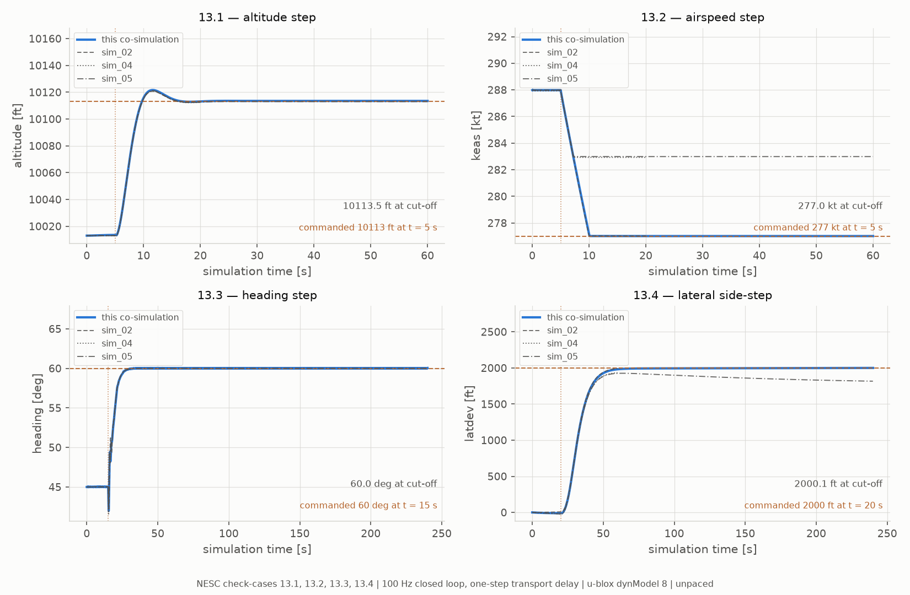
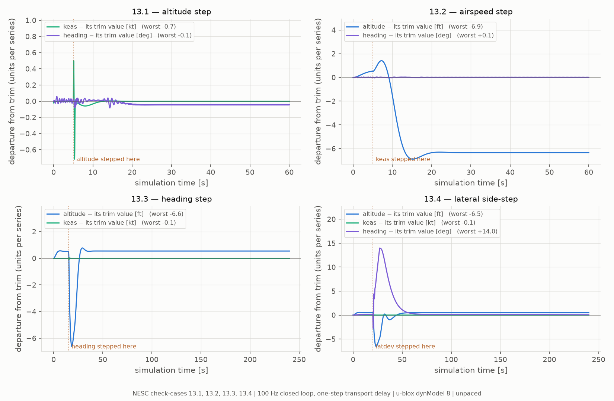
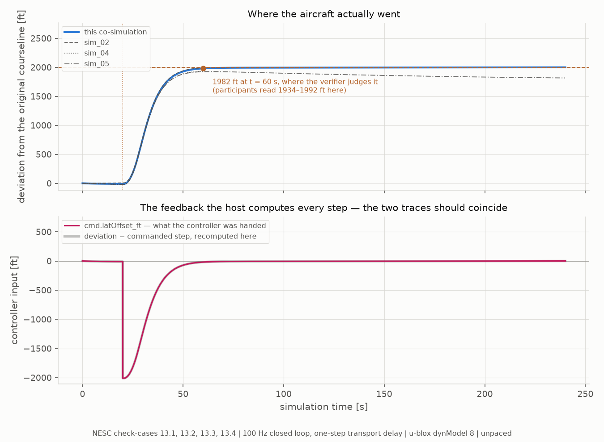
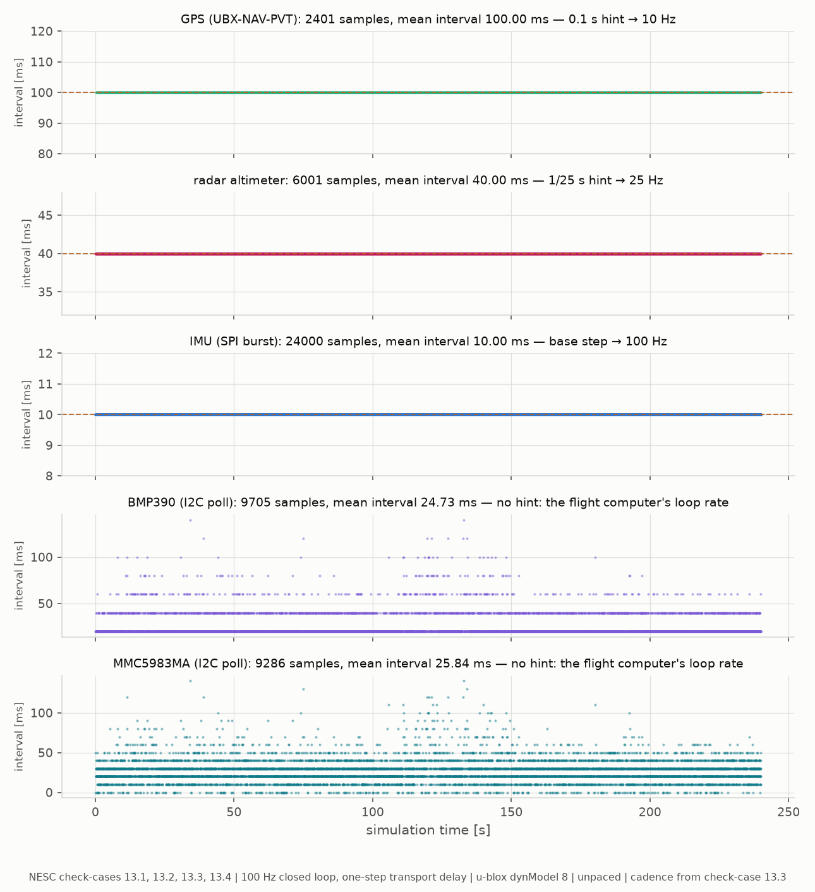

.. ------------------------------------------------------------------------------
.. Project: Hemerion Copyright (c) 2026, Onur Tuncer, PhD, Istanbul Technical University
..
.. SPDX-License-Identifier: GPL-3.0-only
.. License-Filename: LICENSE
.. ------------------------------------------------------------------------------

.. _f16_autopilot_ecos_cosim:

F-16 Autopilot Closed Loop → Five Sensor FMUs → Flight Software Co-Simulation (``examples/f16_autopilot_ecos``)
===============================================================================================================

``examples/f16_autopilot_ecos`` closes the loop the trim flyouts leave open:
Aetherion's ``F16Plant.fmu`` and ``F16Autopilot.fmu`` co-simulated as a
100 Hz sampled control loop, flying NASA TM-2015-218675's four closed-loop
autopilot check-cases — while the five Hemerion sensor FMUs ride the same
truth with the same wiring as :ref:`f16_trim_ecos_cosim`, consumed by **the
same** ``f16_flight_computer`` executable, reused unchanged.

All four cases start from check-case 11's trim condition (Kitty Hawk,
10 013 ft, 335 KTAS, heading 45°) and step exactly one command:

.. list-table::
   :header-rows: 1
   :widths: 14 30 36 20

   * - ``--case``
     - check-case
     - command
     - window
   * - ``13.1`` (default)
     - subsonic altitude change
     - +100 ft (10 013 → 10 113 ft) at t = 5 s
     - 60 s
   * - ``13.2``
     - subsonic airspeed change
     - KEAS → 277 kt (from trim ≈ 288) at t = 5 s
     - 60 s
   * - ``13.3``
     - subsonic heading change
     - course 45 → 60° at t = 15 s
     - 240 s
   * - ``13.4``
     - subsonic lateral side-step
     - 2000 ft right of the courseline at t = 20 s
     - 240 s

Why these runs matter to the sensors: a straight-and-level flyout leaves
heading, tilt and IMU-bias states only weakly observable, which is why
case 11 is a *consistency* reference rather than a fusion test. The 13.x
maneuvers — 13.3 and 13.4 especially — excite exactly those states with
every stack in band throughout. These are the runs the EKF in ``modules/gnc``
will be exercised on.

The loop, and the delay that cannot be removed
----------------------------------------------

.. code-block:: text

   ┌──────────────────────┐  out.* (11 signals)   ┌──────────────────────┐
   │     F16Plant.fmu     ├──────────────────────>│   F16Autopilot.fmu   │   cmd.altCmd_ft, keasCmd_kt,
   │  (Aetherion 6-DoF    │                       │  (DML LQR SAS +      │<─ baseChiCmd_deg, latOffset_ft
   │   plant + trim)      │<──────────────────────┤   autopilot)         │   — the host owns the schedule
   │                      │  ctrl.* (4 surfaces)  └──────────────────────┘
   │                      ├──> the five sensor FMUs, wired as in f16_trim_ecos ──> f16_flight_computer
   └──────────────────────┘

Aetherion's standalone 13.x examples evaluate their DML LQR as a
**zero-order-hold discrete controller at the integration step rate** —
feedback read from the *current* state, surfaces applied over that same
step, no transport delay — at a recommended 0.02 s step; their headers warn
that dt = 0.1 diverges ("LQR plant is stiff").

An Ecos co-simulation cannot reproduce zero delay. Ecos is a Jacobi master:
every instance steps, *then* connections transfer, so the plant flies
[t, t+h] on surfaces the autopilot computed from the state at t−h — one
communication step late, whatever the stepping order. What the host can
choose is h. A one-step delay at h costs about the loop phase of zero-delay
ZOH at 2h, so **h = 0.01 s puts the co-simulation at the standalone's own
recommended cadence**. The control law itself is stateless — a pure LQR gain
evaluation, no integrators — so cadence and delay are the *only* differences
between the two drivers of the same DML. The measured responses below land
on the published solutions.

Two-rate sensors
----------------

The sensors do not follow the loop down to 0.01 s. Ecos' fixed-step
algorithm takes a per-instance step-size hint, stepping that instance every
Nth base step with dt = N × base:

.. list-table::
   :header-rows: 1
   :widths: 30 20 50

   * - instance
     - hint
     - effective rate
   * - plant, autopilot
     - — (base)
     - 100 Hz loop
   * - GPS
     - 0.1 s
     - one NAV-PVT per step of its own = **10 Hz**, as in the trim example —
       the GPS FMU needed no change
   * - radar altimeter
     - 1/25 s
     - 25 Hz — at base rate its ``max(1, lround(dt·rate))`` framing would
       clamp to 100 Hz
   * - IMU
     - — (base)
     - exactly one frame per base step = 100 Hz
   * - BMP390, MMC5983MA
     - — (base)
     - whatever ODR the flight computer programs; stepping rate is irrelevant

Two host-computed inputs
------------------------

As in the trim example, the magnetometer's body-frame field is computed by
the host after every step (a connection modifier sees one source variable;
the field needs four). This example adds a second host-computed input:
**``cmd.latOffset_ft`` is feedback, not a setpoint**. The standalone
computes the aircraft's lateral deviation from the original courseline every
step (flat earth about the initial position, R = 6 371 000 m) and feeds the
controller ``deviation − commanded_step``; the host does the same. It is the
one signal in the loop the plant cannot publish, because it depends on where
the flight *began*. Cases 13.1–13.3 write a constant 0.

**Start-up**: the plant's ``ctrl.*`` inputs start at 0, the plant does not
publish its trim deflections, and Ecos' init rounds hand the plant whatever
the autopilot computed during its own initialisation. The ``trimPoint``
parameter set therefore seeds the autopilot's ``fb.*``/``cmd.*`` inputs with
the trim condition, so its init-time output is the LQR's own answer at trim.
The initial KEAS command is then refined after init from the plant's actual
density and airspeed — printed as ``holding trim KEAS 287.981 kt``, against
the references' 287.92–287.98.

Measured responses
------------------

Unpaced, default configuration:

.. list-table::
   :header-rows: 1
   :widths: 10 22 34 34

   * - case
     - commanded
     - response at cut-off
     - the published participants
   * - 13.1
     - 10 113 ft
     - **10 113.5 ft**, ≈3 ft overshoot at t = 10 s, settled by t = 20 s
     - end within 0.6 ft of the command
   * - 13.2
     - 277 kt
     - **277.0 kt**, altitude dip to 10 006.7 ft
     - sim_02 reaches 277.0 kt and dips to 10 006.4 ft; sim_04/05 are still
       ≈283 kt when their windows end
   * - 13.3
     - course 60°
     - **60.04°** at cut-off (55.1° five seconds into the turn, 59.9° by
       t = 30 s), altitude held to 10 013.5 ft — and 240 s of integrated
       ground track lands **1.5 ft** from ``sim_05``'s lateral deviation
       (32 071.6 vs 32 070.1 ft)
     - participants end 59.92–60.01°
   * - 13.4
     - 2000 ft right
     - **1981.5 ft at t = 60 s**, **2000.1 ft at cut-off**, course back to
       45.07°, altitude held
     - participants read 1934–1992 ft at t = 60 s

Verifying
---------

``verify_trajectory.py`` makes two kinds of check. The NESC-reference
envelope works as in :ref:`f16_trim_ecos_cosim` — participants' own
disagreement as the slack, unequal windows handled by per-sample coverage.
New here is **the commanded response**, which the envelope alone cannot
carry: the participants' altitude spread plus a sensible floor is wider than
13.1's 100 ft step, so a run that never climbed could still sit inside the
envelope. Each case asserts its own response with bounds taken from what the
participants themselves achieve — 13.2's band accepts 275–285.5 kt because
"reached 277 exactly" would fail two of the three published solutions, and
13.4 is judged at t = 60 s, past which the flat-earth deviation formula
itself drifts (``sim_05`` reads 1817 ft at 239.9 s). The hold quantities are
asserted too: an altitude case must hold heading and KEAS.

.. code-block:: console

   $ python verify_trajectory.py --truth results/f16_truth.csv --case 13.1 \
       --reference <aetherion>/data/Atmos_13p1_SubsonicAltitudeChangeF16/Atmos_13p1_sim_02.csv \
       --reference <aetherion>/data/Atmos_13p1_SubsonicAltitudeChangeF16/Atmos_13p1_sim_04.csv \
       --reference <aetherion>/data/Atmos_13p1_SubsonicAltitudeChangeF16/Atmos_13p1_sim_05.csv

Running and building
--------------------

Two terminals, from ``build/examples-native/examples/``:

.. code-block:: console

   $ ./f16_trim_ecos/f16_flight_computer            # terminal 1 — the "STM32" side, reused
   $ ./f16_autopilot_ecos/f16_autopilot_cosim --case 13.3   # terminal 2 — the closed loop

The trim example's pacing caveat applies unchanged to the polled I2C parts
(``--rtf 1`` if their sample counts matter).

Building needs the ``examples-native`` preset and an **Aetherion ≥ 0.14.1**
install for both ``F16Plant.fmu`` and ``F16Autopilot.fmu`` (``AETHERION_ROOT``
if not in a default location; ``--f16`` / ``--ap`` override at runtime).
Configure reads the ports this example binds out of both archives rather
than trusting a version string. The 0.14.1 autopilot FMU exposes **no
parameters** — ``circlePoleSW`` is baked off, which is why NESC cases 15 and
16 (the circumnavigations) are not rows in the ``--case`` table.

Results
-------

``plot_results.py`` (matplotlib) renders these four figures. Unlike the trim
example's script it reads **all four runs at once**, because the four
check-cases are one experiment — same aircraft, same controller, same loop,
exactly one command moved — and the figures that say anything are the ones
that put them side by side:

.. code-block:: console

   $ python plot_results.py --run results/case13p1 --run results/case13p2 \
         --run results/case13p3 --run results/case13p4 \
         --nesc-data <aetherion>/data
   # writes plots/

The participant solutions are located from each run's check-case, so there is
no per-case ``--reference`` list to keep in step with the run list, and the
commanded values and their step times are read from the ``.config`` sidecar
rather than retyped — every response panel draws its own cause.

**These runs are unpaced, and that is the right configuration here.** The trim
example needs ``--rtf 1`` because it steps at 10 Hz and finishes far faster
than wall clock, starving the polled I2C parts. This example steps at 100 Hz
and is the slower of the two by a wide margin: measured, it advances about
**0.15 s of flight per wall-clock second**, so ``--rtf 1`` cannot bind and
would only mislabel the run. The polled parts are the beneficiaries — check
case 13.3 yields 9705 barometer conversions over its 240 s window, about
40 per second of flight against the trim example's 4.5 in a *paced* run.
The 240 s cases take roughly half an hour each; a wall-clock cap on the flight
computer below that truncates its sensor logs while leaving the truth log
looking complete.

   The page's results table, drawn. Each panel plots the quantity its case is
   judged on, with the commanded value and its step time taken from the run's
   own sidecar, and the three published participants over the top.

   The participants are drawn individually rather than as a shaded envelope,
   and they are drawn *over* this run rather than under it. On 13.1 and 13.4
   the agreement is within the width of a line, so whichever went down last
   would be the only one visible; thin dashes riding the trace read as
   agreement, where a missing grey line reads as a missing reference. On 13.2
   the opposite is true and the envelope would have hidden it: ``sim_02``
   reaches 277.0 kt as this run does, while ``sim_04`` and ``sim_05`` are
   still at 283 kt when their windows end. The deceleration authority
   separates the published solutions, which is why the verifier accepts
   275–285.5 kt rather than asserting the command was met.

   Measured at cut-off: **10 113.5 ft** (+2.83 ft over the command at t = 10 s,
   peaking +8.6 ft at t = 11.6 s and settled within half a foot by t = 19.5 s),
   **277.0 kt**, **60.04°** and **2000.1 ft**. Heading here is Euler yaw, not
   course over ground — the command is a course command and the two differ by
   the sideslip, about 0.03° — because yaw is what ``verify_trajectory.py``
   asserts and what this page's tables quote, and one quantity measured three
   ways is how a figure comes to disagree with its own caption.

   Two details the panels make visible that the table cannot. 13.3's heading
   dips to **42.0° at t = 15.4 s** — the wrong way by three degrees — before
   the turn takes. That is adverse yaw at turn entry, not a defect: all three
   participants do the same thing, bottoming out between 41.6° and 42.3°, and
   this run sits inside their spread. And 13.3's reference windows are unequal
   in the opposite direction from the trim cases: ``sim_02`` and ``sim_04``
   stop at t = 30 s while ``sim_05`` runs to 239.9 s.

   What each case had to hold while it manoeuvred — the half of a closed-loop
   check-case that the commanded response cannot carry. An altitude step flown
   by rolling into a turn would sit on the commanded line and still be wrong.

   Each panel plots everything its case did *not* step, as departure from
   where that quantity started, and which quantities those are is read off the
   same sidecar the response figure draws its steps from rather than listed
   twice. That includes heading on 13.4: a side-step flown by turning and
   staying turned would reach the commanded offset and be wrong in exactly the
   way this panel would show. It does not — heading swings **+14.0°** to
   translate the aircraft and comes back to **+0.04°**, which is what a
   side-step is.

   The worst departures over the four cases are 6.9 ft of altitude (13.2,
   during the deceleration), 0.7 kt of KEAS (13.1, a single-sample transient
   at the step) and 0.1° of heading outside 13.4's deliberate excursion. The
   y-axis carries a different unit per series, named in each legend entry:
   these are three different quantities held at once, and the figure is about
   whether each returned, not about comparing feet against knots.

   Check-case 13.4's ``cmd.latOffset_ft``, the one signal in this loop that is
   **feedback rather than a setpoint**. Every other command the host writes and
   forgets; this one it computes every step, from where the aircraft is now
   and where it began, because the controller is fed ``deviation − commanded
   step`` and the plant cannot publish that — it depends on the flight's own
   starting point.

   The lower panel is the check. The crimson trace is ``cmd.latOffset_ft``
   read back out of the truth log — what the controller was actually handed —
   and the thick grey trace under it is the deviation minus the commanded step
   recomputed here from position. They coincide, which is what says the host's
   feedback path is wired the way the standalone's is, on the flat-earth
   formula the standalone uses (R = 6 371 000 m about the initial position).
   It steps to −2000 ft at t = 20 s and decays to zero as the aircraft earns
   the offset.

   The upper panel is why the verifier judges this case at **t = 60 s**, where
   this run reads 1982 ft against the participants' 1934–1992 ft. Past that
   the flat-earth formula drifts out of its own validity — ``sim_05`` reads
   1817 ft at 239.9 s, visibly peeling away — and a run judged there would be
   judged on the formula's error rather than the aircraft's.

   The two-rate scheme, measured rather than asserted. The plant and the
   autopilot run at 100 Hz because the control loop needs it; the sensors do
   not follow them down, and Ecos' per-instance step-size hint is what holds
   them apart. This is the evidence the hints did what they were for, over
   check-case 13.3's 240 s window:

   * GPS — 2401 samples, mean interval **100.00 ms**. Exactly 10 Hz.
   * radar altimeter — 6001 samples, **40.00 ms**. Exactly 25 Hz.
   * IMU — 24000 samples, **10.00 ms**. Exactly one frame per base step.

   The three hinted rows are flat lines, which is the result; their axes are
   pinned to ±20 % of the mean, because an auto-scaled constant is a picture of
   numerical dust.

   The two I2C rows are the interesting ones. They carry no hint at all — a
   BMP390 data register is not a FIFO, so their rate is whatever the flight
   computer's poll loop achieves — and their intervals are a scatter rather
   than a line, averaging 24.73 ms and 25.84 ms. The scatter has structure: it
   lands on bands at multiples of the 10 ms base step, because a polled part
   only has something new to say once the master has stepped it. That is the
   whole reason the trim example's figures come from paced runs, and the
   reason these do not need to be.
