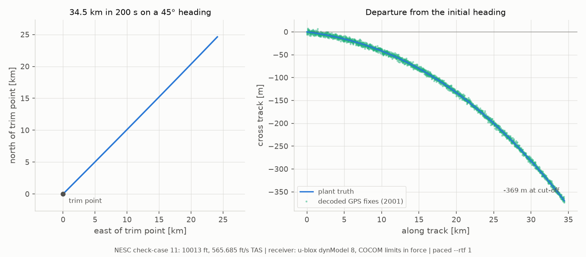
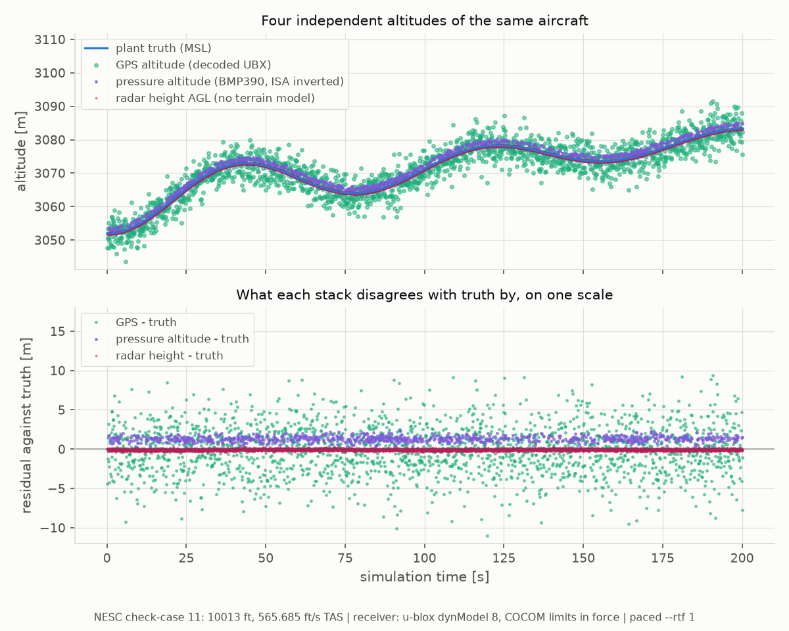
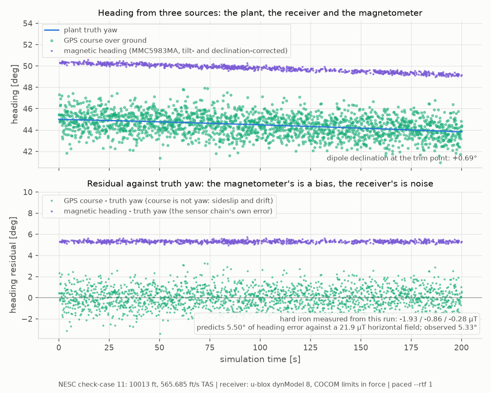
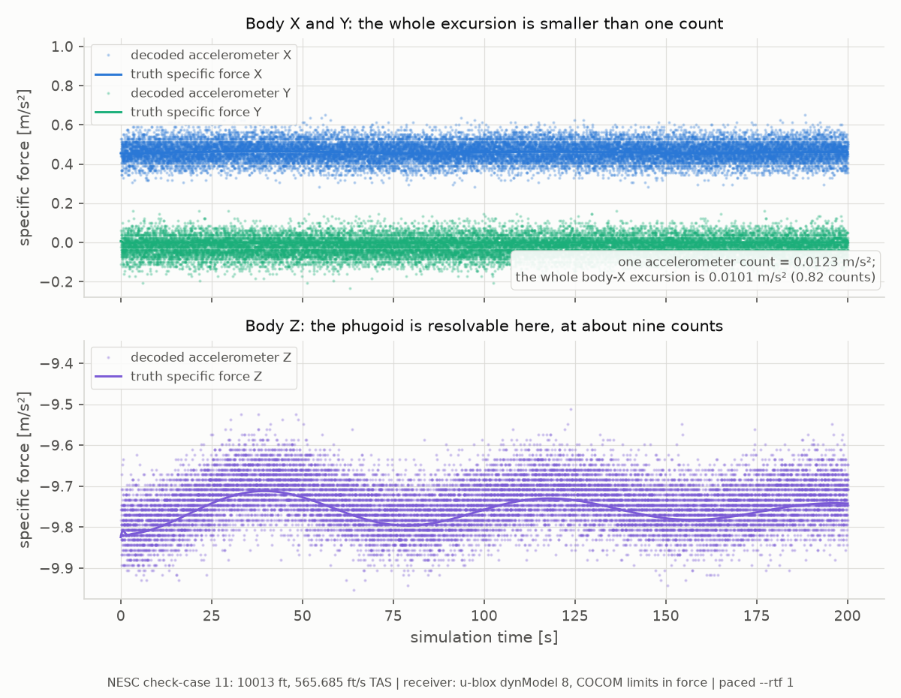
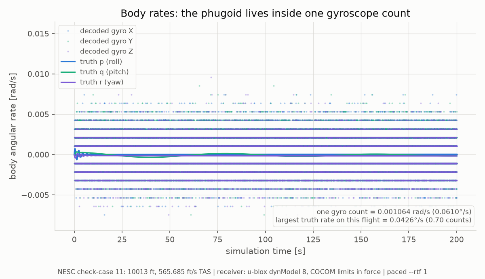
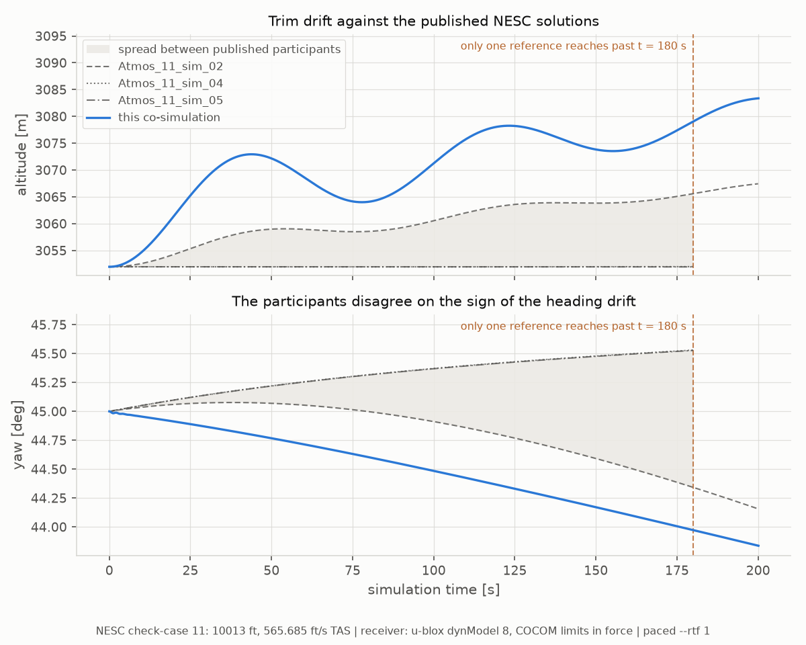
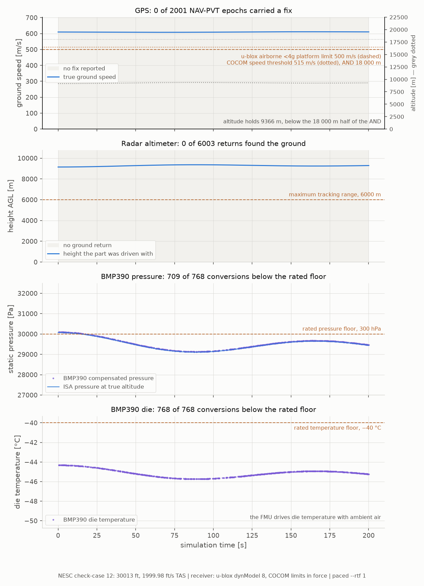
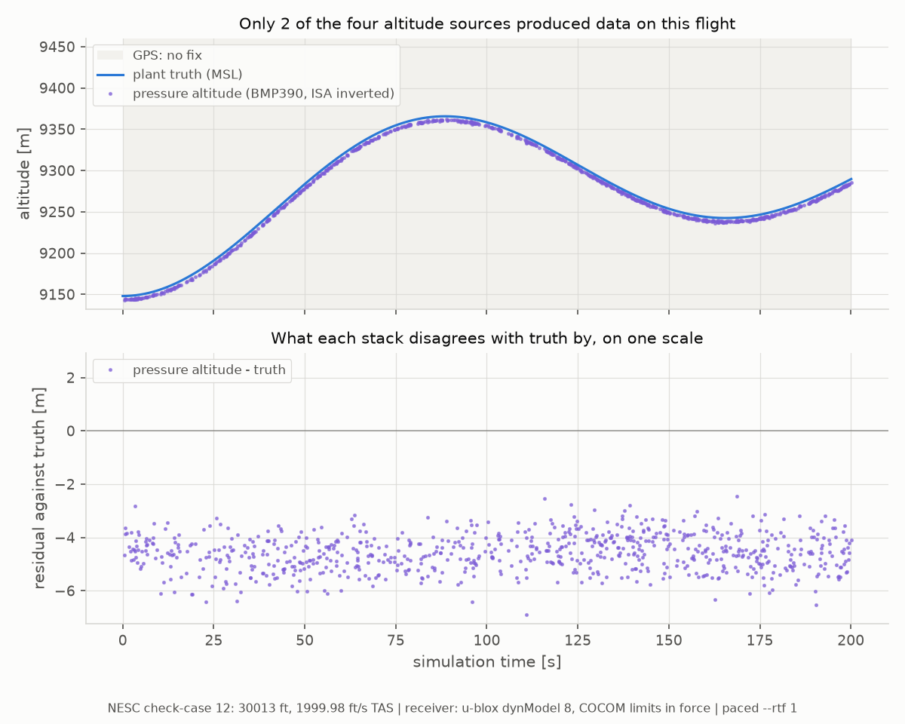

.. ------------------------------------------------------------------------------
.. Project: Hemerion Copyright (c) 2026, Onur Tuncer, PhD, Istanbul Technical University
..
.. SPDX-License-Identifier: GPL-3.0-only
.. License-Filename: LICENSE
.. ------------------------------------------------------------------------------

.. _f16_trim_ecos_cosim:

F-16 Trim Flyouts → Five Sensor FMUs → Flight Software Co-Simulation (``examples/f16_trim_ecos``)
=================================================================================================

``examples/f16_trim_ecos`` flies NASA TM-2015-218675's two open-loop **trim
flyouts** — atmospheric check-cases 11 and 12, selected with ``--case`` —
through the full sensor complement: Aetherion's ``F16Plant.fmu`` supplies
truth, **five** Hemerion hardware-simulator FMUs turn it into bus traffic, and
one flight-computer process consumes all five buses with the unmodified
``modules/sensors`` stacks the STM32H743 firmware cross-compiles.

Four of the six pieces are documented in detail on the rocket page
(:ref:`rocket_gps_ecos_cosim`): the GPS FMU (wire-exact UBX-NAV-PVT over UDP,
gated by the receiver's :ref:`dynamics envelope <gps_dynamics_envelope>`), the
IMU FMU (register counts into a FIFO behind a shared-memory
:ref:`SPI bus <imu_spi_interface>`), the BMP390 FMU (a register-accurate I2C
barometer that inverts the real Bosch compensation polynomial) and the
MMC5983MA FMU (an 18-bit I2C magnetometer whose bridge offset blocks bring-up
until a SET/RESET calibration runs, :ref:`rocket_gps_ecos_mag`). This page
covers what is new here:

1. **The plant is an aircraft in trim, not a rocket under thrust.**
   ``F16Plant.fmu`` runs its own trim solver during initialisation and seeds
   the control deflections from the result, so nothing closes a loop — the
   aircraft simply flies out of trim conditions for 200 s, and the slow
   phugoid drift that follows is the check-case's content, not an error.
2. **The radar altimeter FMU** (``hemerion_radalt_fmu.fmu``), the fifth
   sensor: a pulsed talker like the GPS, on its own UDP port, whose frames are
   fed byte-at-a-time to the unmodified ``RadAltPacketParser`` and converted
   with the part's register sensitivity. Beyond the model's 6000 m maximum
   tracking range its frames carry a *no-return* flag rather than falling
   silent.
3. **Two check-cases over one wiring** — one where every environment-dependent
   stack is in band for the whole flight, and one where three of the four are
   out of their envelopes at once, exercised through exactly the same code
   paths.

.. code-block:: text

   ┌──────────────────────┐   FMI 2.0 variables    ┌──────────────────────┐   UBX-NAV-PVT     ┌─────────────────────────┐
   │    F16Plant.fmu      │  (Ecos connections)    │ hemerion_gps_fmu.fmu │   over UDP        │   f16_flight_computer   │
   │  (Aetherion 6-DoF    ├───────────────────────>│ (u-blox M9N sim)     ├──────────────────>│  GpsDriver + UbxParser  │
   │   plant, Radau IIA   │  lat, lon, alt,        └──────────────────────┘  127.0.0.1:5762   │                         │
   │   on SE(3), with its │  NED velocity          ┌──────────────────────┐  SPI transfers    │  ImuSpiDriver + …       │
   │   own trim solver)   │  p/q/r, specific force │ hemerion_imu_fmu.fmu │<──────────────────┤                         │
   │                      ├───────────────────────>│ (MEMS IMU sim)       ├─── shared mem ───>│  Bmp390Driver + …       │
   │                      │  altitude              ┌──────────────────────┐  I2C transactions │                         │
   │                      ├───────────────────────>│ hemerion_bmp390_fmu  │<─── shared mem ──>│  Mmc5983maDriver + …    │
   │                      │  position + attitude   ┌──────────────────────┐  I2C transactions │                         │
   │                      ├───────────────────────>│ hemerion_mmc5983ma   │<─── shared mem ──>│  RadAltPacketParser +   │
   │                      │  (host-computed)       └──────────────────────┘                   │  convert_raw_to_si      │
   │                      │  altitude as AGL       ┌──────────────────────┐  raw-sample frames│                         │
   │                      ├───────────────────────>│ hemerion_radalt_fmu  ├──────────────────>│  — the same modules/    │
   └──────────────────────┘                        └──────────────────────┘  UDP 5765         │  sensors code the STM32 │
           │                                                                                  │  H743 firmware runs     │
           └────────────── f16_trim_cosim (Ecos master, fixed-step 10 Hz) ────────────────────┴─────────────────────────┘

The two check-cases
-------------------

Both trim the same aircraft over Kitty Hawk, NC (36.019167° N, −75.674444° E)
on a 45° heading and fly it open-loop for 200 s, the window the published
reference trajectories are tabulated over. The whole difference between them
is an altitude and an airspeed — which is why case 12 is a ``--case`` value
rather than a second example:

.. list-table::
   :header-rows: 1
   :widths: 12 30 28 30

   * - ``--case``
     - condition
     - stack
     - what happens to it
   * - ``11`` (default)
     - 10 013 ft, 565.685 ft/s TAS (335 KTAS), Mach 0.52
     - GPS / baro / mag / radalt
     - **everything in band, all 200 s** — 2001 of 2001 GPS epochs carry a
       fix, 3052 m AGL is inside the radar altimeter's range, the barometer
       is squarely in band, 36° N gives the magnetometer a strong,
       near-constant field (49.3–49.5 µT)
   * - ``12``
     - 30 013 ft, 2000 ft/s TAS, Mach 2.01
     - GPS / baro / radalt
     - **all three out of their envelopes at once**, while still talking; only
       the magnetometer (and the IMU) stay in band

Case 11 is the only scenario in the NESC set where all four
environment-dependent sensor stacks are valid at the same time — the
**cross-sensor consistency reference**: baro altitude against GPS altitude
against radar height, magnetic heading against GPS course, all on one
trajectory. It is the case the EKF in ``modules/gnc`` will be judged on.

Case 12 is that EKF's degraded-mode counterpart: the flight where fusion has
to fall back on the IMU and the magnetometer, because everything else is
outside its envelope while still reporting. The rocket scenario
(:ref:`rocket_gps_ecos_cosim`) shows sensors *leaving* their envelopes one by
one as the vehicle accelerates and climbs; case 12 starts outside them and
stays there, which asks a different question of the firmware — bring-up,
self-tests and stream decoding all under conditions the parts were never
specified for.

Signal wiring
-------------

The plant reports geodetic latitude/longitude in degrees and NED velocity in
m/s, which is what the GPS FMU takes, so every truth→receiver connection is
1:1. Body rates connect 1:1 to the IMU's gyro triad, and — since Aetherion
0.14.0 — so does specific force: ``out.specificForce_{x,y,z}_m_s2`` is
(F\ :sub:`aero` + F\ :sub:`thrust`)/m at the CG in body axes with gravitation
structurally excluded, exactly what the IMU FMU's inputs are named for.
Before that port existed the host summed thrust and aero itself, which meant
asserting host-side that thrust acts along body +X; the plant knows its own
installation geometry, and the bench no longer has to guess.

Three connections deserve their own paragraph:

**The radar altimeter measures height above ground, and there is no terrain
model.** ``radalt::h_agl_m`` is fed the plant's MSL altitude — correct to
within the terrain elevation at Kitty Hawk, a few metres of coastal North
Carolina. Over mountains this connection would be wrong, and it is wired bare
rather than through a nominal offset so the assumption is visible in one
line. On case 12 the same connection feeds it 9148 m, past the part's 6000 m
tracking range, so the approximation never matters there.

**The magnetic field is host-computed, not an Ecos connection.** The field a
magnetometer sees depends on where the vehicle is *and* how it is pointing —
four plant outputs — and an Ecos connection modifier sees only its single
source variable. So the host computes a centred-dipole field after every step
and writes ``mag::b_{x,y,z}_ut`` directly, giving the same
one-communication-step transport delay a connection would.
``geomagnetic_field.hpp`` is explicit about the model being a dipole rather
than the WMM and what that costs at this site.

**The magnetometer's die temperature is ambient air** (``out.T_K`` through a
Kelvin→Celsius modifier) — near enough for a part whose temperature channel
quantizes at 0.8 °C, but it matters on case 12, where ambient at 30 013 ft is
−45.9 °C and the part is rated to −40 °C (see below).

Case 11: the cross-sensor reference
-----------------------------------

The question this example is actually responsible for is *does the
co-simulation reproduce the plant?* Against Aetherion ≥ 0.14.1's standalone
``F16SteadyFlight`` — same physics, same library, different driver — over
34 km flown:

.. code-block:: text

   initial position offset       0.491 m (identical initial conditions give 0.000)
   worst ground-track difference 0.494 m (t = 180 s)
   worst altitude difference     0.003 m (t = 40 s)
   worst heading difference      1.88e-07 deg (t = 40 s)

The 0.491 m is not a divergence: it is present at t = 0 and moves by 3 mm
over the whole run. The standalone hardcodes Kitty Hawk to five decimals
where the published condition has six, and that rounding predicts −0.3336 m
north and −0.3597 m east — exactly the measured offset. Run
``./f16_trim_cosim --lat0 36.01917 --lon0 -75.67444`` and the two drivers
agree to **3 mm of ground track, 3 mm of altitude and 2×10⁻⁷ deg of
heading**. That is why the verifier prints the initial offset on its own
line: an initial-condition difference and a divergence look identical in a
"worst difference" figure.

Two findings this comparison surfaced, one closed and one open:

* **Closed (Aetherion 0.14.1): two drivers trimmed against different
  gravity.** Before 0.14.1, ``F16Plant.fmu`` built its trim weight from J2
  gravity at the trim position while Aetherion's standalone examples used the
  sea-level constant 9.80665 m/s² — 0.045 % apart at Kitty Hawk, hence
  1.85×10⁻³ deg of trim alpha, which a 70 s phugoid grew into 5.97 m of
  ground track and 2.16 m of altitude by t = 200 s. It was never integration
  error: a 10× finer communication step changed nothing. 0.14.1 moved every
  F-16 standalone onto the FMU's J2 weight; comparing against an older
  standalone reproduces the disagreement and fails the verifier on all three
  checks — the default tolerances (1 m / 0.05 m / 10⁻⁵ deg) were set so this
  bug fails each of them by an order of magnitude or more.
* **Open (Aetherion-side): its trim is not NESC's.** Both Aetherion paths now
  trim to the same initial pitch, 2.656087°, against the published 2.643331°
  (case 11) — and it is no longer a weight question (20 509.3 vs 20 509.4 lbf).
  The leading suspect is that ``TrimSolver`` balances lift against weight
  with no Earth-rotation or curvature terms while the integrator flies over a
  rotating round Earth; at this flight condition those terms relieve 0.42 %
  of the required lift, predicting a trim-alpha shift of the right sign and
  order (135 % of the observed gap). A lead, not a finding.

Against the published NESC participant solutions the check is a sanity bound,
not a precision test: at t = 180 s ``Atmos_11_sim_02`` has drifted −0.66° of
heading and +44.7 ft while ``sim_04``/``sim_05`` drift +0.53° *the other way*
and hold altitude to a tenth of a foot. This run drifts more than any
published participant — up to ~16 m of altitude and 0.44° of heading beyond
the participants' own spread, in ``sim_02``'s direction — which is the open
Aetherion-side trim question above showing up in the flyout.

Case 12: the flight the sensors cannot follow
---------------------------------------------

``./f16_trim_cosim --case 12`` — no other change. Measured over a full 200 s
paced run (``--rtf 1``), the same run the figures at the foot of this page are
drawn from:

.. list-table::
   :header-rows: 1
   :widths: 18 82

   * - stack
     - measured behaviour
   * - GPS, default ``--dyn-model 8``
     - **0 of 2001 epochs carry a fix.** 610 m/s exceeds the airborne
       platform model's 500 m/s limit from the very first epoch: a Mach 2
       aircraft with an airborne-configured u-blox is flying without GPS. The
       receiver keeps emitting one NAV-PVT per epoch throughout —
       ``gnssFixOK`` clear, no position in the payload.
   * - GPS, ``--dyn-model -1``
     - **The fix comes back: 300 of 300 epochs over a 30 s run**, at
       609.8 m/s and 9214 m. That is COCOM's AND holding — the cut-off needs
       18 000 m *and* 515 m/s, and 9.2 km is half the altitude threshold.
       This is the one flight in the NESC set that tells COCOM's AND apart
       from an OR; the rocket crosses both thresholds within seconds of each
       other and cannot.
   * - radar altimeter
     - **6003 of 6003 returns report no ground.** 9148 m is past the part's
       6000 m tracking range. The part keeps reporting — a sensor that is
       working and has nothing to say — and ``valid`` is a CSV column rather
       than a filter precisely so this record is not an empty file.
   * - BMP390
     - **709 of 768 conversions below the part's 300 hPa rated pressure
       floor** (minimum 291.2 hPa), and **all 768 with the die below its
       −40 °C rating** — it sits at −45.7 °C, since the FMU drives die
       temperature with ambient air. The part model saturates only at the ADC
       rails, so the out-of-rating conversions read plausibly — as on the real
       silicon, which offers no out-of-rating indication either. The FMU adds
       the side channel the part cannot: its ``conversions`` /
       ``conversions_out_of_rating`` FMI outputs count the violation (the host
       prints them in its summary), and each envelope crossing is debug-logged
       once with the offending value. These two counts are the ones that move
       with pacing: unpaced, the same flight yields 286 conversions and the
       same proportions.
   * - magnetometer, IMU
     - In band. On this flight they are all the sensor fusion has left.

The plant's phugoid is bigger here — +218 m peak altitude excursion and
+0.47° of heading over the window — and the published participants split the
same way they do on case 11: ``sim_02`` climbs +140 m through its phugoid
while ``sim_04``/``sim_05`` hold altitude to 0.3 m.

Against Aetherion's standalone ``F16SupersonicTrim`` (≥ 0.14.1) the run
verifies exactly as case 11 does: 0.491 m constant initial offset (the same
five-decimal rounding), 0.000 m worst altitude difference, 1.4×10⁻⁷ deg worst
heading difference — and the NESC sanity bound passes.

Building
--------

Needs the ``examples-native`` preset and an **Aetherion ≥ 0.14.0** install for
``F16Plant.fmu`` (set ``AETHERION_ROOT`` if it is not in a default location;
``--f16`` overrides the path at runtime):

.. code-block:: console

   $ cmake --preset examples-native
   $ cmake --build build/examples-native

The version floor is a pair of port requirements that landed in different
releases — 0.13.0 put geodetic position into degrees, 0.14.0 added
``out.specificForce_{x,y,z}_m_s2`` — and configure tests for each separately,
reading ``modelDescription.xml`` out of the located FMU rather than trusting a
version number that ``AETHERION_ROOT`` could aim at a stale build tree.
:ref:`rocket_gps_ecos_setup` covers setting up Ecos and Aetherion on a bare
machine.

Running
-------

Two terminals, both in ``build/examples-native/examples/f16_trim_ecos/``:

.. code-block:: console

   $ ./f16_flight_computer                    # terminal 1 — the "STM32" side
   $ ./f16_trim_cosim                         # terminal 2 — check-case 11 (default)
   $ ./f16_trim_cosim --case 12               #   or check-case 12
   $ ./f16_trim_cosim --case 12 --dyn-model -1  # case 12 with the platform envelope removed

The flight computer takes no case option: it decodes whatever arrives,
unchanged between the two — which is itself the result.

**Pace it if you care about the I2C parts.** The BMP390 and MMC5983MA are
polled, and their sample rate is the flight computer's loop rate, not the ODR
programmed into their registers. Unpaced, the co-simulation finishes far
faster than wall clock and starves them: 200 s of flight yields about **37
baro conversions**, while ``--rtf 1`` yields roughly 23× the rate. The GPS,
IMU and radar altimeter are unaffected — their data queues in a socket or a
FIFO. :ref:`rocket_gps_ecos_pacing` has the full mechanics, and the note
there about Ecos' ``tar``/``unzip`` spawning applies here too
(``f16_trim_cosim`` runs the same preflight check).

Verifying
---------

``verify_trajectory.py`` keeps two bars apart, because they have very
different resolution:

.. code-block:: console

   $ python verify_trajectory.py \
       --truth results/f16_truth.csv \
       --reference <aetherion>/data/Atmos_11_TrimCheckSubsonicF16/Atmos_11_sim_02.csv \
       --reference <aetherion>/data/Atmos_11_TrimCheckSubsonicF16/Atmos_11_sim_04.csv \
       --reference <aetherion>/data/Atmos_11_TrimCheckSubsonicF16/Atmos_11_sim_05.csv \
       --aetherion <aetherion>/f16_s11_dt0.1.csv

For a ``--case 12`` run, substitute
``Atmos_12_TrimCheckSupersonicF16/Atmos_12_sim_0{2,4,5}.csv`` and a standalone
``F16SupersonicTrim`` output.

**Against the NESC references** — a sanity bound: the participants disagree
with each other by design-revealing amounts (see the case sections above).
Two traps in that data set are worth knowing:

* ``sim_04`` and ``sim_05`` stop at **t = 180 s**; only ``sim_02`` reaches
  200 s. A verifier that skips any sample time not covered by *every*
  reference silently leaves the last 20 s unchecked and still prints OK.
  This one compares against whatever references reach each time and prints
  the coverage.
* Comparing the three files' *last rows* compares t = 200 against t = 180 and
  invents a ~2.4 km disagreement. At equal times the spread is ~181 m of
  ground track.

**Against an Aetherion standalone run** — the tight bar, with the figures and
tolerances quoted in the case sections above. The standalone references are
regenerated from an Aetherion build ≥ 0.14.1 (it must include
``TrimWeight.h``), from the Aetherion root:

.. code-block:: console

   $ <build>/src/Examples/F16SteadyFlight/F16SteadyFlight --timeStep 0.1 --endTime 200 \
         --writeInterval 1 --inputFileName unused --outputFileName f16_s11_dt0.1.csv

(``F16SupersonicTrim`` for case 12; ``--inputFileName`` is required by the CLI
but ignored.)

Neither check looks only at altitude. On straight-and-level flight altitude
is nearly constant, so an altitude-only comparison passes for a vehicle that
flew a circle at the right height. Ground track and heading carry the
information.

Results
-------

``plot_results.py`` (matplotlib) renders the six CSVs — the host's truth log
and the flight computer's five decoded-sensor logs — into seven figures per
check-case:

.. code-block:: console

   $ python plot_results.py \
       --truth results/f16_truth.csv \
       --reference <aetherion>/data/Atmos_11_TrimCheckSubsonicF16/Atmos_11_sim_02.csv \
       --reference <aetherion>/data/Atmos_11_TrimCheckSubsonicF16/Atmos_11_sim_04.csv \
       --reference <aetherion>/data/Atmos_11_TrimCheckSubsonicF16/Atmos_11_sim_05.csv
   # reads results/, writes plots/case11_*.png

Filenames carry the check-case, read from the ``.config`` sidecar
``f16_trim_cosim`` writes beside the truth log, so a case-11 and a case-12 run
fill one directory instead of overwriting each other. That prefix is doing
real work here: the two cases produce figures identical in *form* and opposite
in *content*, and a PNG separated from its caption has nothing else to say
which flight it came from. Every figure is stamped at the foot with the
check-case, the flight condition, the receiver configuration and whether the
run was paced.

**All figures below are from paced runs** (``--rtf 1``). Unpaced, 200 s of
flight yields about 37 barometer conversions against the 896 here, and the
altitude- and heading-consistency figures become a scatter of dots through
which no trace can be read. The GPS, IMU and radar-altimeter figures are
unaffected either way — their data queues in a socket or a FIFO — which is why
the barometer is the only stack whose counts move with the pacing. The case-12
table above is measured on the same paced run as these figures.

Check-case 11: the cross-sensor reference
~~~~~~~~~~~~~~~~~~~~~~~~~~~~~~~~~~~~~~~~~

   The flyout, and the departure the flyout cannot show. At true aspect ratio
   (left) an open-loop trim flyout is a straight line: 34.5 km on a 45°
   heading, and drawing the 2001 decoded fixes on top of it would be a lie of
   resolution, since 1.5 m of injected horizontal noise sits inside the width
   of the line itself.

   The right panel is the same flight with the commanded heading rotated out:
   cross-track departure in metres against kilometres flown. The aircraft is
   asked to hold 45° and the phugoid turns it, reaching **−369 m by cut-off**
   — and *this* is the quantity the published participants disagree about. It
   is also the scale at which the receiver's error is finally visible as what
   it is: a metre-scale scatter about a track that departs by hundreds.

   The figure check-case 11 exists for. Barometric altitude, GNSS altitude and
   radar height are three physically unrelated measurements — a pressure, a
   set of ranging solutions, a time of flight to the ground — and a filter that
   is going to trust their agreement should be shown that agreement first, on a
   flight where all three are valid for all 200 s.

   The lower panel is the content, and the three error *characters* are the
   point rather than the three magnitudes:

   * **GPS is noise.** Mean −0.08 m, RMS 3.07 m over 2001 fixes — which is
     ``GpsNoiseConfig``'s 3 m vertical 1-sigma recovered end to end, through
     the UBX encoder, the socket and the parser, with nothing added.
   * **The barometer is bias.** Mean **+1.32 m**, RMS 1.36 m: the scatter is
     almost all offset. In pressure it is a constant −11.7 Pa with 3.1 Pa of
     scatter — the BMP390 model's per-run turn-on offset (30 Pa 1-sigma, drawn
     once) sitting on its datasheet noise floor, read through the ISA at
     0.904 kg/m³. No amount of averaging removes it; only a reference pressure
     does.
   * **The radar altimeter is the noise floor.** RMS 0.123 m about a mean of
     −0.07 m — the model's 0.1 m range noise on its 5 cm turn-on bias, then
     quantised. It is the most accurate altitude on the page and the least
     useful on its own, since it measures height above terrain that this
     scenario does not model.

   The second half of the cross-sensor claim, and the harder half. Recovering
   a heading from a magnetometer needs the aircraft's own tilt and the local
   declination; both are taken from the simulation here — truth roll and
   pitch, and the declination of the same centred dipole the host drove the
   FMU with — because the question is whether the *sensor chain* preserves
   heading, not whether an attitude filter can be built.

   **The magnetometer is 5.3° off, and it is supposed to be.** The MMC5983MA
   model draws a hard-iron offset once per run, 1 µT 1-sigma per axis, on top
   of the bridge offset. The bridge offset is what a SET/RESET pair cancels,
   and the driver's bring-up calibration duly removes it — the residual here is
   what SET/RESET *cannot* touch, because hard iron is a real field the
   installation adds rather than an electrical null error.

   The figure measures that offset from the run rather than asserting it. The
   mean of (decoded − truth field) is **−1.93 / −0.86 / −0.28 µT**, which
   against this site's 21.9 µT horizontal field predicts **5.50°** of heading
   error; the observed residual is **5.33°**. Those two numbers agreeing is
   the check that the tilt compensation above is right, and the reason the
   remaining 0.17° can be read as geometry rather than as a decoding fault.

   The consequence for ``modules/gnc`` is the whole point: raw magnetic
   heading is not a heading reference. The bias is constant, observable, and
   exactly the kind of state an EKF is supposed to estimate — which is what
   makes case 11 the flight to judge it on. GPS course, meanwhile, is not yaw
   at all (it is where the velocity vector points, not the nose), and its
   residual is the noise plus the sideslip, not an error.

   Specific force, split by scale because one axis cannot carry both: body Z
   sits near −9.8 m/s² holding the aircraft up while X and Y live within
   hundredths of zero, and drawn together the lateral and forward channels
   collapse onto a line.

   The upper panel is the honest result. One accelerometer count is
   **0.0123 m/s²**, and the entire body-X excursion over 200 s of flight is
   **0.0101 m/s² — 0.82 of one count**. The forward channel of this IMU cannot
   see the phugoid at all; what varies in that band is the noise model, not the
   aircraft. The lower panel is the counter-case: body Z moves about nine
   counts, and the phugoid is plainly there, riding visibly through the
   discrete levels.

   This figure looks broken and is not. The decoded samples lie on discrete
   bands because the gyroscope is a 16-bit part at ±2000 °/s — one count is
   **0.0610 °/s** — and on an open-loop trim flyout *every body rate the
   aircraft actually has is smaller than one count*. The largest truth rate
   over the whole flight is 0.0426 °/s, **0.70 of a count**; the truth traces
   run through the middle of the zero band, and the banding above and below is
   the noise model being quantised, not motion.

   It earns a figure of its own for what it rules out. A filter cannot
   integrate these rates into an attitude on this flight — the signal is below
   the sensor's resolution, so dead reckoning has nothing to work with, and
   heading has to come from the magnetometer and the receiver instead. That is
   the argument for the two consistency figures above, made by the sensor that
   fails to make it.

   This run against the published participant solutions — a sanity bound, not
   a precision test, and the figure is drawn to make that unmistakable. The
   shaded band is the spread *between the published solutions*: where it is
   narrow the participants agree and a deviation means something, and where it
   is wide they do not and it does not.

   On altitude the band is wide by t = 100 s, and this run sits above it,
   drifting +31.4 m through its phugoid where ``sim_04`` and ``sim_05`` hold
   altitude to a tenth of a foot. On heading the participants disagree about
   the *direction* of the drift, and this run turns −1.16° — ``sim_02``'s way,
   past ``sim_02``. Both are the open Aetherion-side trim question of the case
   sections above, showing up in the flyout.

   The band stops before the plot does, and is marked where it stops. Only
   ``sim_02`` reaches t = 200 s; a verifier that compares nothing but the times
   every reference covers leaves the last 20 s silently unchecked and still
   prints OK.

Check-case 12: three stacks outside their envelopes
~~~~~~~~~~~~~~~~~~~~~~~~~~~~~~~~~~~~~~~~~~~~~~~~~~~

e -40 C floor

   The whole difference between the two check-cases, in one figure. Each panel
   puts a stack against the limit that bounds it; on case 11 every trace sits
   clear of its line for 200 s, and here three of the four are on the wrong
   side of it from the first epoch — **while every part keeps talking**. That
   distinction is what the example is built to make: an envelope violation is
   not a silent bus, and none of these figures is an empty file.

   * **GPS: 0 of 2001 epochs carried a fix.** 610 m/s is past the airborne
     <4 g platform model's 500 m/s bound from the very first epoch. The
     receiver keeps emitting one NAV-PVT per epoch throughout, ``gnssFixOK``
     clear, no position in the payload.
   * **COCOM is an AND, and this is the flight that proves it.** The speed
     threshold (515 m/s, dotted) is exceeded and the altitude threshold is
     not — the grey dotted trace holds 9366 m against an 18 000 m bound. An
     OR receiver would have lost the fix to COCOM here; this one does not, and
     what takes the fix is the platform model instead. The rocket scenario
     crosses both thresholds within seconds of each other and cannot tell the
     two apart.
   * **Radar altimeter: 0 of 6003 returns found the ground.** 9.2 km is half
     again the part's 6000 m tracking range. It keeps reporting — a sensor
     that is working and has nothing to say — which is why ``valid`` is a CSV
     column rather than a filter.
   * **BMP390: 709 of 768 conversions below the rated 300 hPa floor**
     (minimum 291.2 hPa), with the die at −45.7 °C for **all 768**, below its
     −40 °C rating. The part model saturates only at the ADC rails, so the
     out-of-rating conversions read plausibly — as they would on real silicon,
     which offers no out-of-rating indication either. The FMU supplies the side
     channel the part cannot: ``conversions_out_of_rating`` counts the
     violation on an FMI output.

   The same figure as the case-11 altitude comparison, on the flight where
   there is nothing to compare. The no-fix wash runs the full width, the radar
   altimeter contributes nothing, and **one of the four altitude sources
   survives** — the barometer, running 700 conversions below the pressure its
   part is rated for.

   Its residual is worth reading rather than dismissing. The bias is
   **−4.56 m** here against +1.32 m on case 11, and it is still a bias: RMS
   4.61 m against a mean of −4.56, so the scatter is almost entirely offset.
   In pressure it is +20.2 Pa with the same 3 Pa of scatter — a fresh draw of
   the model's 30 Pa turn-on offset, since every run draws its own. What the
   flight changes is the exchange rate: at 9.2 km the air is 0.458 kg/m³,
   half of case 11's, so **the same pressure error buys twice the altitude**.
   The sensor has not become noisy outside its rating; a barometer's fixed
   pressure error is simply worth more metres the higher it flies. A fusion
   filter given this stack alone on this flight would hold altitude
   confidently, and hold it four and a half metres low.
