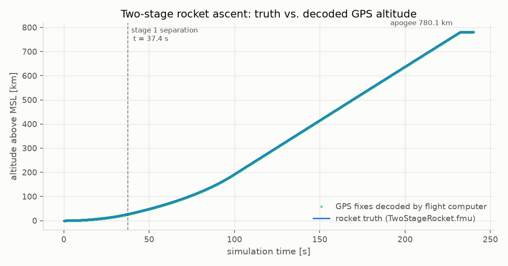
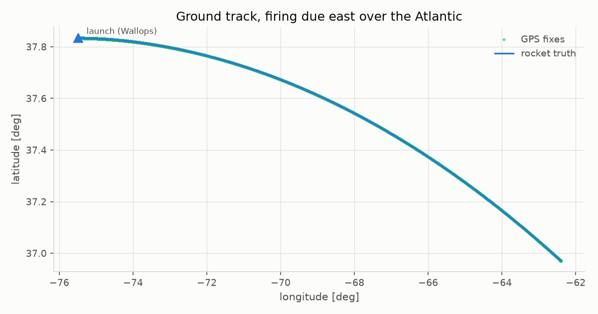
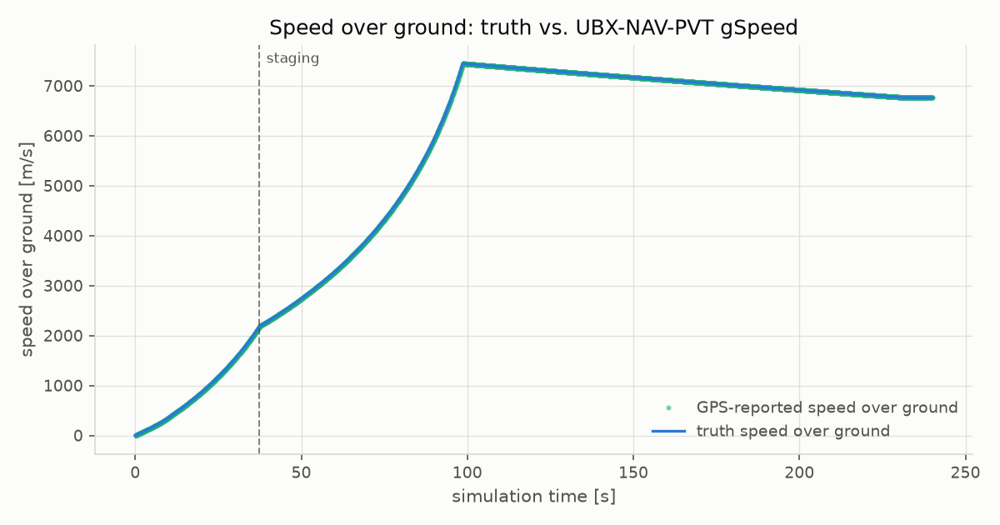
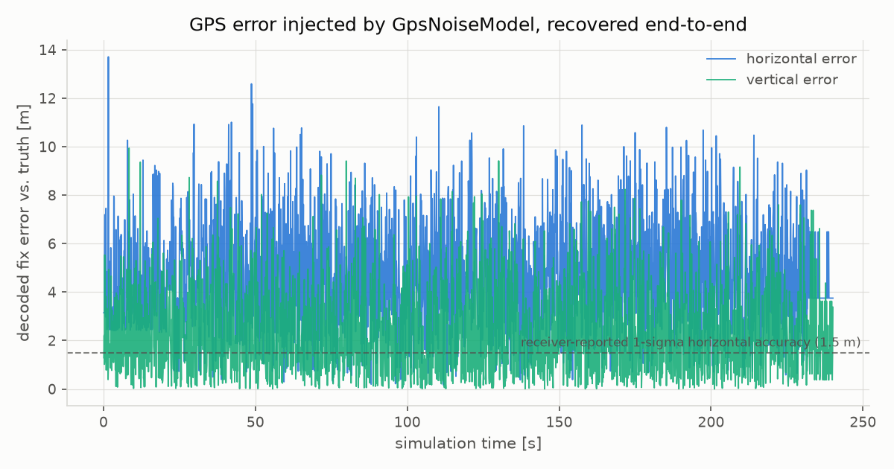
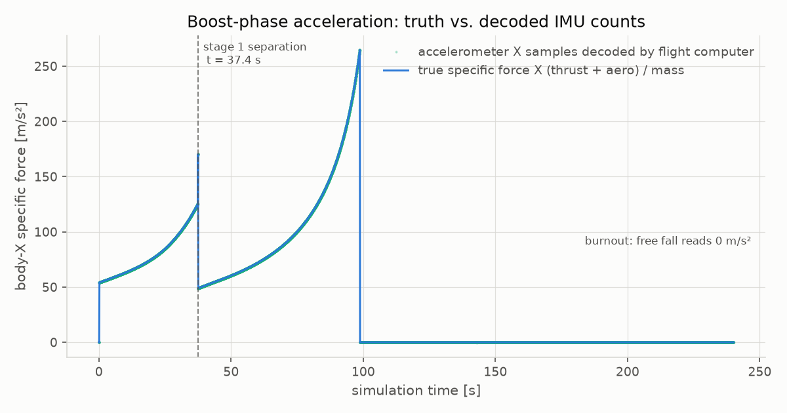
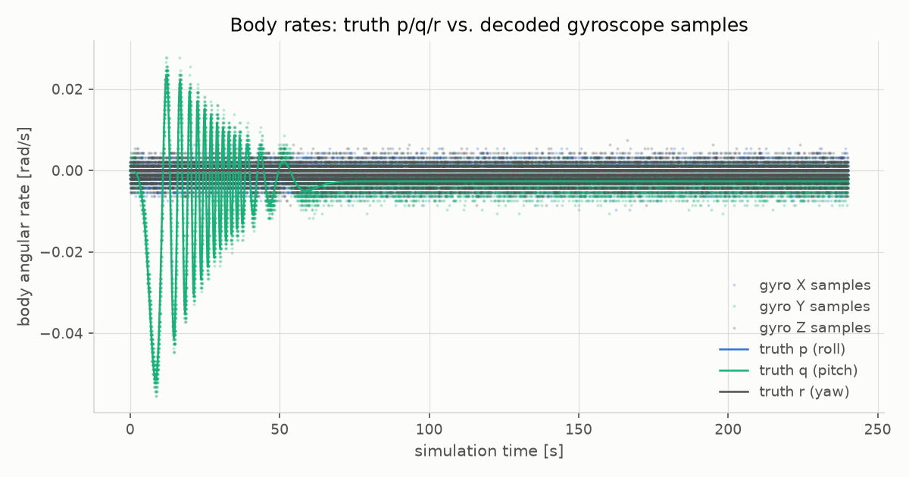

.. ------------------------------------------------------------------------------
.. Project: Hemerion Copyright (c) 2026, Onur Tuncer, PhD, Istanbul Technical University
..
.. SPDX-License-Identifier: GPL-3.0-only
.. License-Filename: LICENSE
.. ------------------------------------------------------------------------------

.. _rocket_gps_ecos_cosim:

Rocket → GPS + IMU → Flight Software Co-Simulation (``examples/rocket_gps_ecos``)
=================================================================================

``examples/rocket_gps_ecos`` couples four independently developed pieces into
one sensor-in-the-loop scenario, orchestrated by the
`Ecos <https://github.com/Ecos-platform/ecos>`_ FMI co-simulation platform:

1. **Aetherion's two-stage rocket plant** (``TwoStageRocket.fmu``) supplies the
   *truth* trajectory — a 6-DoF rocket (NASA TM-2015-218675 Scenario 17:
   DAVE-ML aero/propulsion/inertia tables, J2 gravity, stage separation)
   integrated with a Radau IIA RKMK scheme on SE(3).
2. **Hemerion's GPS hardware-simulator FMU** (``hemerion_gps_fmu.fmu``, from
   ``modules/sensors``) turns that truth into what a real u-blox M9N would
   report: Gaussian position/velocity noise plus the receiver's self-reported
   accuracies, encoded as **wire-exact UBX-NAV-PVT frames** sent over UDP —
   one frame per co-simulation step.
3. **Hemerion's IMU hardware-simulator FMU** (``hemerion_imu_fmu.fmu``, also
   from ``modules/sensors``) turns true body-frame specific force and angular
   rate into what a tactical-grade MEMS part would latch: per-run turn-on bias
   plus white noise, quantized to **16-bit register counts** (±40 g /
   ±2000 °/s sensitivity) and framed as Hemerion IMU raw-sample packets over
   UDP — 100 Hz, ten frames per co-simulation step.
4. **The flight software sensor stacks** (``gps_flight_computer``) decode both
   byte streams with the *unmodified* ``GpsDriver``/``UbxParser`` and
   ``ImuPacketParser``/``convert_raw_to_si()`` from ``modules/sensors`` — the
   same code the STM32H743 firmware cross-compiles. Only the transport differs
   from the target: UDP sockets on the host, UART/SPI RX lines (or Renode's
   emulated peripherals, see :ref:`swil_windows_setup`) on hardware.

.. code-block:: text

   ┌──────────────────────┐  FMI 2.0 variables    ┌──────────────────────┐  UBX-NAV-PVT    ┌────────────────────────┐
   │  TwoStageRocket.fmu  │  (Ecos connections)   │ hemerion_gps_fmu.fmu │  over UDP       │  gps_flight_computer   │
   │  Aetherion 6-DoF     ├──────────────────────>│ u-blox M9N hardware  ├────────────────>│  GpsDriver + UbxParser │
   │  rocket plant        │  lat, lon, alt,       │ simulator: noise +   │ 127.0.0.1:5762  │  + ImuPacketParser +   │
   │  (truth)             │  NED velocity         │ UBX encoder          │ 1 frame / step  │  convert_raw_to_si     │
   │                      │                       └──────────────────────┘                 │  (the code the STM32   │
   │                      │  p/q/r (connections), ┌──────────────────────┐  raw counts     │  H743 firmware runs)   │
   │                      │  specific force       │ hemerion_imu_fmu.fmu │  over UDP       │                        │
   │                      ├──────────────────────>│ MEMS IMU simulator:  ├────────────────>│                        │
   │                      │  (host-computed)      │ bias + noise +       │ 127.0.0.1:5763  │                        │
   └──────────────────────┘                       │ register quantizer   │ 10 frames /step │                        │
            │                                     └──────────────────────┘                 └────────────────────────┘
            └───────────── rocket_gps_cosim: Ecos master, fixed step 0.1 s (10 Hz GPS, 100 Hz IMU) ────────┘

.. contents:: On this page
   :local:
   :depth: 2

---

Signal wiring
-------------

``rocket_gps_cosim`` builds the coupling with Ecos' C++ API
(``simulation_structure``). The rocket reports geodetic position in
**radians**; the GPS FMU takes **degrees**, so the two conversions ride on the
Ecos connections as modifiers. Velocity is wired 1:1 into the GPS FMU's NED
inputs, from which it derives speed-over-ground and course itself. Body rates
wire 1:1 into the IMU FMU:

.. list-table::
   :header-rows: 1
   :widths: 34 32 34

   * - ``TwoStageRocket`` output
     - Ecos connection modifier
     - Sensor FMU input
   * - ``out.lat_rad``
     - rad → deg
     - ``gps::latitude_deg``
   * - ``out.lon_rad``
     - rad → deg
     - ``gps::longitude_deg``
   * - ``out.alt_m``
     - —
     - ``gps::altitude_m``
   * - ``out.v_north_m_s``
     - —
     - ``gps::v_north_mps``
   * - ``out.v_east_m_s``
     - —
     - ``gps::v_east_mps``
   * - ``out.v_down_m_s``
     - —
     - ``gps::v_down_mps``
   * - ``out.p_rad_s``
     - —
     - ``imu::p_rad_s``
   * - ``out.q_rad_s``
     - —
     - ``imu::q_rad_s``
   * - ``out.r_rad_s``
     - —
     - ``imu::r_rad_s``

In code:

.. code-block:: cpp

    ecos::simulation_structure ss;
    ss.add_model("rocket", options.rocket_fmu.string());
    ss.add_model("gps", options.gps_fmu.string());
    ss.add_model("imu", options.imu_fmu.string());

    const std::function<double(const double&)> rad2deg =  {
      return rad * (180.0 / std::numbers::pi);
    };
    ss.make_connection<double>("rocket::out.lat_rad", "gps::latitude_deg", rad2deg);
    ss.make_connection<double>("rocket::out.lon_rad", "gps::longitude_deg", rad2deg);
    ss.make_connection<double>("rocket::out.alt_m", "gps::altitude_m");
    ss.make_connection<double>("rocket::out.v_north_m_s", "gps::v_north_mps");
    ss.make_connection<double>("rocket::out.v_east_m_s", "gps::v_east_mps");
    ss.make_connection<double>("rocket::out.v_down_m_s", "gps::v_down_mps");
    ss.make_connection<double>("rocket::out.p_rad_s", "imu::p_rad_s");
    ss.make_connection<double>("rocket::out.q_rad_s", "imu::q_rad_s");
    ss.make_connection<double>("rocket::out.r_rad_s", "imu::r_rad_s");

    const auto sim = ss.load(std::make_unique<ecos::fixed_step_algorithm>(0.1));
    sim->init("launchSite");

**Specific force** — what an accelerometer actually measures, the sum of the
non-gravitational forces over mass — has no direct rocket output, and it
involves three of them: :math:`\mathbf{f} = (F_{thrust}\hat{x} +
\mathbf{F}_{aero}) / m`. An Ecos connection modifier sees only its single
source variable, so the host computes ``f`` from ``out.thrust_N``,
``out.aero_F{x,y,z}_N`` and ``out.mass_kg`` after every step and writes the
IMU FMU's ``f_x/f_y/f_z_mps2`` inputs through Ecos properties — the same
one-communication-step transport delay a connection would have:

.. code-block:: cpp

    sim->step();
    const double m = mass->get_value();
    imu_fx->set_value((thrust->get_value() + aero_fx->get_value()) / m);
    imu_fy->set_value(aero_fy->get_value() / m);
    imu_fz->set_value(aero_fz->get_value() / m);

Neither sensor FMU has **FMI output variables**: their outputs are byte
streams, exactly like a real receiver's UART or a real IMU's data registers.
That keeps the firmware parsers exercised at the byte level — sync characters,
little-endian scaled integers, checksums and all — rather than handing the
flight software convenient floating-point values it would never see on the
vehicle. The IMU frames carry raw register counts; the flight software
converts them to SI with the same ±40 g / ±2000 °/s ``ImuScale`` the FMU
quantized with, standing in for a driver that knows the full-scale ranges it
configured into the part.

Building
--------

Requires a native toolchain, network access at configure time (Ecos and its
FMU loader fmi4c are fetched and built from source), and an Aetherion install
for ``TwoStageRocket.fmu`` (set ``AETHERION_ROOT`` if it is not in a default
location; without it the example still builds and ``--rocket <path>`` selects
the FMU at runtime):

.. code-block:: console

   $ cmake --preset examples-native
   $ cmake --build build/examples-native

Besides the two example executables this also produces
``hemerion_gps_fmu.fmu`` and ``hemerion_imu_fmu.fmu`` — the
``hemerion_gps_fmu_package``/``hemerion_imu_fmu_package`` targets zip each
simulator into a proper FMI 2.0 archive (``modelDescription.xml`` at the
archive root, the shared library under ``binaries/win64/`` or
``binaries/linux64/``).

Running
-------

Two terminals, both in ``build/examples-native/examples/rocket_gps_ecos/``.
The flight computer starts first, since it binds the sensor FMUs' default UDP
destinations (5762/GPS, 5763/IMU):

.. code-block:: console

   $ ./gps_flight_computer          # terminal 1 — the "STM32" side
   $ ./rocket_gps_cosim             # terminal 2 — the Ecos master

The default flight lasts 240 s at a 0.1 s communication step — a 10 Hz GPS
navigation rate. Staging occurs at t ≈ 37 s, apogee (≈ 780 km) at t ≈ 232 s;
the Scenario 17 plant holds its state constant after apogee, so longer runs
only add a flat tail. ``--rtf 1`` paces the master to wall-clock speed to
watch the fix stream arrive live; unpaced, the run takes about 2.5 minutes.

Ecos master console
~~~~~~~~~~~~~~~~~~~

.. code-block:: text

   [cosim] rocket: C:/Program Files/Aetherion/share/Aetherion/fmu/TwoStageRocket.fmu
   [cosim] gps:    D:/Dev/Hemerion/build/examples-native/modules/sensors/include/Hemerion/gps/fmu/hemerion_gps_fmu.fmu
   [cosim] imu:    D:/Dev/Hemerion/build/examples-native/modules/sensors/include/Hemerion/imu/fmu/hemerion_imu_fmu.fmu
   [cosim] step 0.1 s (10 Hz GPS, 100 Hz IMU), stop 240 s
   [cosim] t=10 s  alt=1828.52 m  mach=1.52854  mass=265846 kg
   [cosim] t=20 s  alt=7244.12 m  mach=3.63514  mass=217693 kg
   [cosim] t=30 s  alt=16616.3 m  mach=6.5223  mass=169539 kg
   [cosim] t=37.4 s  stage 1 separated
   [cosim] t=40 s  alt=30913.4 m  mach=9.31213  mass=95506.8 kg
   [cosim] t=50 s  alt=48441.5 m  mach=10.0596  mass=82433.4 kg
   ...
   [cosim] t=230 s  alt=770855 m  mach=29.3356  mass=18897 kg
   [cosim] t=240 s  alt=780141 m  mach=29.3034  mass=18897 kg
   [cosim] done: 2401 steps, 2401 UBX-NAV-PVT frames and 24010 IMU frames emitted
   [cosim] apogee 780141 m at t=232.1 s, staging at t=37.4 s
   [cosim] rocket truth written to results/rocket_truth.csv

Flight computer console
~~~~~~~~~~~~~~~~~~~~~~~

Every 50th decoded fix and every 1000th decoded IMU sample is printed; note
the data is what the *sensors* report — truth plus the injected noise —
decoded from raw bytes:

.. code-block:: text

   [fc] listening for UBX-NAV-PVT on UDP port 5762 (GpsDriver, protocol=UBX) and IMU raw-sample frames on UDP port 5763 (ImuPacketParser)
   [fc] fix     1  t=    0.1 s  lat= 37.8338021  lon= -75.4879018  alt=      1.7 m  vel=    0.0 m/s  crs=  0.1 deg  sats=11
   [fc] imu      1  t=    0.0 s  f=[    0.01   -0.01    0.04] m/s2  w=[  0.0011  0.0000 -0.0032] rad/s
   [fc] fix    50  t=    5.0 s  lat= 37.8337980  lon= -75.4836010  alt=    431.8 m  vel=  156.8 m/s  crs= 89.4 deg  sats=11
   [fc] imu   1000  t=   10.0 s  f=[   62.95   -0.04    0.97] m/s2  w=[  0.0000 -0.0298 -0.0011] rad/s
   [fc] imu   4000  t=   40.0 s  f=[   51.23   -0.07   -0.25] m/s2  w=[  0.0000  0.0021  0.0021] rad/s
   [fc] imu   9000  t=   90.0 s  f=[  165.11    0.04    0.00] m/s2  w=[  0.0000 -0.0043 -0.0021] rad/s
   [fc] imu  10000  t=  100.0 s  f=[   -0.12    0.02    0.06] m/s2  w=[ -0.0032 -0.0021  0.0000] rad/s
   ...
   [fc] fix  2400  t=  240.0 s  lat= 36.9722100  lon= -62.4137047  alt= 780139.9 m  vel= 6762.7 m/s  crs= 99.4 deg  sats=11
   [fc] imu  24000  t=  240.0 s  f=[   -0.07    0.05   -0.02] m/s2  w=[ -0.0032 -0.0043  0.0000] rad/s
   [fc] sensor streams quiet for 3000 ms -- co-simulation finished
   [fc] summary: 2401 fixes decoded (0 checksum errors), 24010 IMU samples decoded (0 checksum errors)
   [fc] max altitude 780152 m, max ground speed 7444.9 m/s
   [fc] max |specific force| 264.632 m/s2, max |body rate| 0.055544 rad/s
   [fc] fixes written to results/gps_fixes.csv, IMU samples to results/imu_samples.csv

**2401 UBX frames and 24010 IMU frames sent, 2401 fixes and 24010 samples
decoded, zero checksum errors on either stream** — the whole chain from 6-DoF
truth through both noise models, both encoders, UDP, and the on-target
parsers is lossless and wire-correct. The IMU physics also reads correctly
off the decoded stream: ~55 m/s² of thrust acceleration at ignition rising to
~265 m/s² at stage-2 burnout (t ≈ 100 s), then **zero specific force in free
fall** — an accelerometer does not sense gravity.

Results
-------

``plot_results.py`` (matplotlib) renders the three CSVs — Ecos' truth log and
the flight computer's fix and IMU-sample logs — into the figures below:

.. code-block:: console

   $ python plot_results.py       # reads results/, writes plots/

   Truth altitude and the fixes the flight software decoded. At this scale the
   two are indistinguishable — which is the point.

   Ground track: launch from Wallops Flight Facility, firing due east over the
   Atlantic. The southward curl is the J2/rotating-Earth effect on an eastward
   suborbital arc.

   Speed over ground: truth vs. the NAV-PVT ``gSpeed`` field the parser
   recovered. The slope change at staging and burnout (t ≈ 100 s) is visible.

   Decoded-fix error against truth. The band is flat across three decades of
   altitude and speed and matches the configured receiver noise
   (``GpsNoiseConfig``: 1.5 m horizontal / 3 m vertical, 1-sigma) — the error
   the flight software sees is *exactly* the error that was injected, with no
   distortion added by the encode/transmit/parse chain.

   Body-X specific force: truth (thrust + aero over mass) vs. the samples the
   flight software recovered from raw register counts. Acceleration climbs as
   propellant burns off — ~55 m/s² at ignition to ~265 m/s² at stage-2
   burnout — and drops to exactly zero in free fall: an accelerometer does
   not sense gravity.

   Body rates: the damped pitch-rate oscillation during atmospheric flight is
   tracked by the decoded gyro-Y samples; the horizontal banding in the
   sample cloud is the gyroscope's LSB quantization (1 count ≈ 0.0011 rad/s
   at ±2000 °/s full scale) resolving the configured noise floor —
   register-level realism the flight software has to live with on the real
   part too.

One detail matters when comparing fixes against truth: the Ecos master
propagates connections *between* steps, so the fix emitted at the end of step
*k* carries the truth sampled at the end of step *k−1* — one communication
step (0.1 s) of transport delay, just like a real receiver's navigation-epoch
latency. At 7 km/s that step is ~700 m of along-track motion, so the error
plot aligns each fix with the truth one step earlier; naive equal-timestamp
alignment would show latency, not receiver error. (The IMU plots need no such
realignment: the truth CSV's ``f_x/f_y/f_z`` columns are the ``imu::`` input
variables themselves — already the zero-order-held, one-step-delayed value
the FMU actually sampled.)

Implementation notes
--------------------

Ecos and fmi4c compatibility
~~~~~~~~~~~~~~~~~~~~~~~~~~~~

Two properties of the FMU loader Ecos uses (`fmi4c
<https://github.com/Ecos-platform/fmi4c>`_) shaped both sensor FMUs:

* fmi4c resolves the **complete FMI 2.0 export table** up front and refuses to
  load a binary that omits any function. The sensor FMUs therefore export stub
  implementations (returning ``fmi2Error``) of the state-management and
  derivative functions their capability flags disable
  (``fmi2GetFMUstate`` … ``fmi2GetRealOutputDerivatives``).
* fmi4c's XML parser (ezxml) rejects ``--`` sequences inside XML comments —
  they are in fact illegal per the XML specification — which constrains the
  comment style used in ``model_description.xml``.

Both are good conformance pressure: any strict FMI master would be within its
rights on either count.

Ecos on Windows, cross-drive paths
~~~~~~~~~~~~~~~~~~~~~~~~~~~~~~~~~~

``simulation_structure::add_model`` has a ``std::filesystem::path`` overload
that internally converts the path with ``std::filesystem::relative()``. On
Windows that yields an *empty* path when the FMU lives on a different drive
than the working directory (e.g. FMU on ``C:``, build tree on ``D:``), so the
example passes plain absolute-path *strings*, which Ecos' file resolver
handles as-is.

Timing model
~~~~~~~~~~~~

One NAV-PVT frame is emitted per communication step, so the flight computer
maps fix index → simulation time when logging (``--fix-period``, default
0.1 s). When the master runs faster than real time, wall-clock arrival times
are meaningless; the index mapping is exact as long as no datagram is dropped,
and the summary line makes loss visible (decoded counts vs. the master's step
count). IMU frames carry the simulation clock in their payload instead, so
their timestamps come straight off the wire. ``--rtf 1`` runs the
co-simulation paced to the wall clock, which makes the streams realistic
enough to demo live consumers.

A real IMU samples far faster than a 10 Hz co-simulation step, so the IMU FMU
emits ``round(step × sample_rate_hz)`` frames per ``fmi2DoStep`` (default
100 Hz → 10 frames per step), each with a fresh noise draw and its own
timestamp. The truth inputs are zero-order-held across the step — the master
only exchanges variables at communication points — which is the honest
equivalent of oversampling a plant that is itself only resolved at the
communication rate.

The IMU on the same truth bus
~~~~~~~~~~~~~~~~~~~~~~~~~~~~~

The IMU FMU follows the pattern the GPS FMU established — truth in over FMI,
sensor-realistic bytes out the side channel — and the same pattern extends to
any further sensor (barometer, magnetometer, radar altimeter): a noise model
and an emitter under ``modules/sensors/include/Hemerion/<sensor>/fmu/``, an
on-target parser next to the driver code, and a round-trip unit test proving
the two stay byte-compatible. The wire format is deliberately *not* UBX: the
Hemerion IMU frame has its own sync bytes (``0xA5 0x5A``), so an interleaved
GPS/IMU byte stream can never desync one parser into the other's frames, and
the payload is raw register counts — scale (±40 g, ±2000 °/s) is
*configuration* both ends know, exactly as with real silicon, not wire data.
