.. ------------------------------------------------------------------------------
.. Project: Hemerion Copyright (c) 2026, Onur Tuncer, PhD, Istanbul Technical University
..
.. SPDX-License-Identifier: GPL-3.0-only
.. License-Filename: LICENSE
.. ------------------------------------------------------------------------------

.. _rocket_gps_ecos_cosim:

Rocket → GPS + IMU + Baro + Mag → Flight Software Co-Simulation (``examples/rocket_gps_ecos``)
==============================================================================================

``examples/rocket_gps_ecos`` couples six independently developed pieces into
one sensor-in-the-loop scenario, orchestrated by the
`Ecos <https://github.com/Ecos-platform/ecos>`_ FMI co-simulation platform:

1. **Aetherion's two-stage rocket plant** (``TwoStageRocket.fmu``) supplies the
   *truth* trajectory — a 6-DoF rocket (NASA TM-2015-218675 Scenario 17:
   DAVE-ML aero/propulsion/inertia tables, J2 gravity, stage separation)
   integrated with a Radau IIA RKMK scheme on SE(3).
2. **Hemerion's GPS hardware-simulator FMU** (``hemerion_gps_fmu.fmu``, from
   ``modules/sensors``) turns that truth into what a real u-blox M9N would
   report: Gaussian position/velocity noise plus the receiver's self-reported
   accuracies, gated through the receiver's **dynamics envelope** — the COCOM
   export limits, which stop navigation output above 18 km *and* 515 m/s — and
   encoded as **wire-exact UBX-NAV-PVT frames** sent over UDP, one frame per
   co-simulation step whether or not that frame carries a solution.
3. **Hemerion's IMU hardware-simulator FMU** (``hemerion_imu_fmu.fmu``, also
   from ``modules/sensors``) turns true body-frame specific force and angular
   rate into what a tactical-grade MEMS part would latch: per-run turn-on bias
   plus white noise, quantized to **16-bit register counts** (±40 g /
   ±2000 °/s sensitivity) and framed as Hemerion IMU raw-sample packets into
   the part's **sample FIFO** at 100 Hz — ten per co-simulation step. It does
   not send them anywhere: it is an **SPI peripheral**, and answers
   chip-select-framed transfers on a bus carried in shared memory.
4. **Hemerion's BMP390 barometer-simulator FMU** (``hemerion_bmp390_fmu.fmu``,
   also from ``modules/sensors``) takes exactly one truth input — altitude —
   maps it through the ICAO Standard Atmosphere and the part's error model,
   then *numerically inverts the real Bosch compensation polynomial* to the
   raw 24-bit ADC words a physical part would have converted. It answers a
   shared-memory **I2C bus** as a register-accurate part: ``CHIP_ID``, the
   21-byte calibration NVM, ``OSR``/``ODR``/``PWR_CTRL``, shadowed data +
   ``SENSORTIME`` bursts. It has no rate parameter: it converts at whatever
   ODR the flight computer programs into its registers — none while
   ``PWR_CTRL`` still reads sleep.
5. **Hemerion's MMC5983MA magnetometer-simulator FMU**
   (``hemerion_mmc5983ma_fmu.fmu``, also from ``modules/sensors``) takes the
   body-frame magnetic field the vehicle is flying through and turns it into
   18-bit register counts on a second shared-memory **I2C bus**. It is the
   only part in this scenario whose bring-up the flight computer *blocks* on:
   the MMC5983MA carries a Wheatstone-bridge offset specified only to
   ±0.5 gauss — the size of Earth's whole field — and removing it takes a
   SET, a measurement, a RESET, a second measurement and a final SET before
   the first useful reading exists. See :ref:`rocket_gps_ecos_mag`.
6. **The flight software sensor stacks** (``gps_flight_computer``) drive all
   four buses with the *unmodified* ``GpsDriver``/``UbxParser``,
   ``ImuSpiDriver``/``ImuPacketParser``/``convert_raw_to_si()``,
   ``Bmp390Driver``/``Bmp390Compensator`` and ``Mmc5983maDriver`` from
   ``modules/sensors`` — the same code the STM32H743 firmware cross-compiles.
   Only the transport shims differ from the target: a UDP socket where the
   receiver's UART would be, and shared-memory SPI and I2C buses where
   ``HAL_SPI_TransmitReceive`` / ``HAL_I2C_Mem_Read`` plus the GPIOs would be
   (or Renode's emulated peripherals, see :ref:`swil_windows_setup`).

.. code-block:: text

   ┌──────────────────────┐  FMI 2.0 variables    ┌──────────────────────┐  UBX-NAV-PVT    ┌────────────────────────┐
   │  TwoStageRocket.fmu  │  (Ecos connections)   │ hemerion_gps_fmu.fmu │  over UDP       │  gps_flight_computer   │
   │  Aetherion 6-DoF     ├──────────────────────>│ u-blox M9N simulator │────────────────>│  GpsDriver + UbxParser │
   │  rocket plant        │  lat, lon, alt,       │ noise + COCOM        │ 127.0.0.1:5762  │                        │
   │  (truth)             │  NED velocity         │ envelope + UBX enc.  │ 1 frame / step  │  ImuSpiDriver +        │
   │                      │                       └──────────────────────┘                 │  ImuPacketParser +     │
   │                      │  p/q/r (connections), ┌──────────────────────┐   SPI transfers │  convert_raw_to_si     │
   │                      │  specific force       │ hemerion_imu_fmu.fmu │<────────────────┤                        │
   │                      ├──────────────────────>│ MEMS IMU simulator:  │  over shared    │  Bmp390Driver +        │
   │                      │  (host-computed)      │ bias + noise + regs  │──────  memory ─>│  Bmp390Compensator     │
   │                      │                       │ + 16 KiB sample FIFO │  bursts of      │                        │
   │                      │  altitude             └──────────────────────┘  raw counts     │  Mmc5983maDriver +     │
   │                      ├──────────────────────>┌──────────────────────┐ I2C transactions│  convert_raw_to_si     │
   │                      │                       │ hemerion_bmp390_fmu  │<────────────────┤                        │
   │                      │                       │ register-accurate    │  over shared    │  (the code the STM32   │
   │                      │                       │ BMP390: ISA + regs   │──────  memory ─>│  H743 firmware runs)   │
   │                      │                       │ + calibration NVM    │  raw ADC words  │                        │
   │                      │  position + attitude  └──────────────────────┘                 │                        │
   │                      │  -> body-frame field  ┌──────────────────────┐ I2C transactions│                        │
   │                      ├──────────────────────>│ hemerion_mmc5983ma   │<────────────────┤                        │
   └──────────────────────┘  (host-computed)      │ _fmu: MMC5983MA with │  over shared    │                        │
            │                                     │ SET/RESET bridge     │──────  memory ─>│                        │
            │                                     │ offset + hard iron   │  18-bit counts  └────────────────────────┘
            │                                     └──────────────────────┘
            └─ rocket_gps_cosim: Ecos master, fixed step 0.1 s (10 Hz GPS, 100 Hz IMU, baro + mag at programmed rates) ─┘

The arrow directions are the point. The receiver *talks*; the IMU, the
barometer and the magnetometer are *polled*. Modelling all four as byte
streams pushed at the flight computer would have exercised the packet parsers
and nothing else — no register map, no FIFO, no chip select, no ODR register,
no SET/RESET handshake, none of the sequence firmware actually runs against an
inertial part, a barometer or a magnetometer.

.. contents:: On this page
   :local:
   :depth: 2

---

Signal wiring
-------------

``rocket_gps_cosim`` builds the coupling with Ecos' C++ API
(``simulation_structure``). The rocket reports geodetic position in
**radians**; the GPS FMU takes **degrees**, so the two conversions ride on the
Ecos connections as modifiers. Velocity is wired 1:1 into the GPS FMU's NED
inputs, from which it derives speed-over-ground and course itself. Body rates
wire 1:1 into the IMU FMU:

.. list-table::
   :header-rows: 1
   :widths: 34 32 34

   * - ``TwoStageRocket`` output
     - Ecos connection modifier
     - Sensor FMU input
   * - ``out.lat_rad``
     - rad → deg
     - ``gps::latitude_deg``
   * - ``out.lon_rad``
     - rad → deg
     - ``gps::longitude_deg``
   * - ``out.alt_m``
     - —
     - ``gps::altitude_m``
   * - ``out.v_north_m_s``
     - —
     - ``gps::v_north_mps``
   * - ``out.v_east_m_s``
     - —
     - ``gps::v_east_mps``
   * - ``out.v_down_m_s``
     - —
     - ``gps::v_down_mps``
   * - ``out.p_rad_s``
     - —
     - ``imu::p_rad_s``
   * - ``out.q_rad_s``
     - —
     - ``imu::q_rad_s``
   * - ``out.r_rad_s``
     - —
     - ``imu::r_rad_s``
   * - ``out.alt_m``
     - —
     - ``baro::h_m``

In code:

.. code-block:: cpp

    ecos::simulation_structure ss;
    ss.add_model("rocket", options.rocket_fmu.string());
    ss.add_model("gps", options.gps_fmu.string());
    ss.add_model("imu", options.imu_fmu.string());
    ss.add_model("baro", options.baro_fmu.string());

    const std::function<double(const double&)> rad2deg =  {
      return rad * (180.0 / std::numbers::pi);
    };
    ss.make_connection<double>("rocket::out.lat_rad", "gps::latitude_deg", rad2deg);
    ss.make_connection<double>("rocket::out.lon_rad", "gps::longitude_deg", rad2deg);
    ss.make_connection<double>("rocket::out.alt_m", "gps::altitude_m");
    ss.make_connection<double>("rocket::out.v_north_m_s", "gps::v_north_mps");
    ss.make_connection<double>("rocket::out.v_east_m_s", "gps::v_east_mps");
    ss.make_connection<double>("rocket::out.v_down_m_s", "gps::v_down_mps");
    ss.make_connection<double>("rocket::out.p_rad_s", "imu::p_rad_s");
    ss.make_connection<double>("rocket::out.q_rad_s", "imu::q_rad_s");
    ss.make_connection<double>("rocket::out.r_rad_s", "imu::r_rad_s");
    ss.make_connection<double>("rocket::out.alt_m", "baro::h_m");

    const auto sim = ss.load(std::make_unique<ecos::fixed_step_algorithm>(0.1));
    sim->init("launchSite");

**Specific force** — what an accelerometer actually measures, the sum of the
non-gravitational forces over mass — has no direct rocket output, and it
involves three of them: :math:`\mathbf{f} = (F_{thrust}\hat{x} +
\mathbf{F}_{aero}) / m`. An Ecos connection modifier sees only its single
source variable, so the host computes ``f`` from ``out.thrust_N``,
``out.aero_F{x,y,z}_N`` and ``out.mass_kg`` after every step and writes the
IMU FMU's ``f_x/f_y/f_z_mps2`` inputs through Ecos properties — the same
one-communication-step transport delay a connection would have:

.. code-block:: cpp

    sim->step();
    const double m = mass->get_value();
    imu_fx->set_value((thrust->get_value() + aero_fx->get_value()) / m);
    imu_fy->set_value(aero_fy->get_value() / m);
    imu_fz->set_value(aero_fz->get_value() / m);

None of the sensor FMUs has **FMI output variables**: their outputs are byte
streams, exactly like a real receiver's UART, a real IMU's data registers or
a real barometer's shadowed data block.
That keeps the firmware parsers exercised at the byte level — sync characters,
little-endian scaled integers, checksums and all — rather than handing the
flight software convenient floating-point values it would never see on the
vehicle. The IMU frames carry raw register counts; the flight software
converts them to SI with the same ±40 g / ±2000 °/s ``ImuScale`` the FMU
quantized with, standing in for a driver that knows the full-scale ranges it
configured into the part.

The receiver's configuration
----------------------------

The GPS FMU's dynamics envelope is what makes this scenario interesting, so
``rocket_gps_cosim`` writes it explicitly rather than inheriting the FMU's
defaults silently:

.. code-block:: cpp

    launch_site["gps::dynamic_platform"] = -1;     // no platform envelope: COCOM alone
    launch_site["gps::cocom_limits_enabled"] = true;
    launch_site["gps::reacquisition_time_s"] = 2.0;

What that leaves in force is a single mechanism:

* the **COCOM export limits** stop navigation output above 18 000 m *and*
  515 m/s. An AND, which is why a high-altitude balloon and a fast low-altitude
  sled both keep their fix while a sounding rocket does not. Not a
  configuration choice — it is in every receiver you can buy;
* recovery is not instantaneous either: the fix stays invalid for
  ``reacquisition_time_s`` after the vehicle re-enters the envelope, standing
  in for the tracking loops re-acquiring.

The limit is evaluated against *truth*, not against the noisy fix — it
is the vehicle's real motion that breaks carrier tracking, not the receiver's
estimate of it. When it trips, the fix is degraded in place: fix type drops
to ``kNoFix`` so ``UbxEmitter`` clears NAV-PVT's ``gnssFixOK`` flag, satellite
count goes to zero, accuracies inflate — and the frame is still emitted.
Position and velocity fields keep carrying the invalid solution, as on a real
receiver, and consumers are expected to gate on the fix type.
``gps_flight_computer`` does, logs the epoch with its ``fix_type`` column but
without the meaningless position, and reports the window.

Driving the IMU over SPI
------------------------

The IMU side has no stream to receive. ``gps_flight_computer`` runs the
on-target ``ImuSpiDriver`` against the simulated part, and the sequence is the
one the firmware's IMU task performs:

.. code-block:: cpp

    ImuSpiDriver imu_driver(imu_bus);          // imu_bus: the only host-specific piece
    imu_driver.probe();                        // WHO_AM_I, then CONTROL = FIFO enable | reset

    while (imu_driver.data_ready())            // the part's DRDY line
    {
      const auto result = imu_driver.poll(batch.data(), batch.size());
      // -> reads STATUS + FIFO_COUNT in one 4-byte transfer,
      //    bursts the FIFO port, feeds every byte to ImuPacketParser
    }

``ImuSpiBus`` is the whole difference between running that here and running it
on the STM32: one chip-select-framed transfer, and a read of the data-ready
pin. On the host it wraps :file:`sim/spi_shm`'s controller; on the target it
wraps ``HAL_SPI_TransmitReceive`` between two GPIO writes. The register map,
the FIFO semantics and the byte-level parsing are the same object code either
way — see :ref:`imu_spi_interface` for the part's registers and what the
handshake granularity does and does not model.

Two consequences worth knowing when reading a run:

* ``probe()`` writes ``FIFO_RESET``, so any samples the FMU buffered before
  the flight computer attached are discarded — a driver clearing whatever
  accumulated before it took over. Start the flight computer first (it waits
  for the bus) and nothing is lost.
* the part's FIFO is 16 KiB, about 420 frames or four seconds at 100 Hz. A
  controller slower than that loses whole samples, never framing, and finds
  out through the sticky overflow bit, which the summary line reports.

.. _rocket_gps_ecos_mag:

Driving the magnetometer over I2C
---------------------------------

The magnetometer is the only sensor in this scenario whose bring-up *blocks on
the plant*, and that is what makes it worth having here. The other three parts
are configured and then read. The MMC5983MA has to be **conditioned** first.

Its sensing elements are Wheatstone bridges of anisotropic magneto-resistive
film, and the bridge carries an electrical offset that the datasheet bounds
only at ±0.5 gauss — which is the size of Earth's entire field. A reading
taken without dealing with it is not a slightly noisy field measurement; it is
a field measurement plus an unknown vector of comparable magnitude. The part
provides the way out in hardware: an on-die coil that re-magnetises the film
in either direction. After a SET the field enters the bridges positively,
after a RESET negatively, and the bridge offset — being electrical, not
magnetic — does not flip with it:

.. code-block:: text

   after SET     output = null + H·S + offset
   after RESET   output = null − H·S + offset
                 ⇒  H·S   = (set − reset) / 2      the field
                    offset = (set + reset) / 2 − null

So ``Mmc5983maDriver::calibrate_offset()`` is a five-step handshake, and every
step is a separate I2C transaction with a poll loop between:

.. code-block:: cpp

    Mmc5983maDriver mag_driver(mag_bus);
    mag_driver.probe();     // product ID, software reset, bandwidth, SET,
                            // then: SET → measure → RESET → measure →
                            //       average → SET again → continuous mode

    while (true)
    {
      MagSample sample;
      if (mag_driver.read_sample(sample) == Mmc5983maReadResult::kSample)
      {
        // Status polled, seven data bytes burst, Meas_M_Done acknowledged,
        // null field and the calibrated bridge offset subtracted, converted
        // to microtesla by the same convert_raw_to_si() the IMU path uses.
      }
    }

That final SET is not decoration. Leaving the part RESET produces readings
that are still offset-corrected and still the right magnitude, and every axis
negated — the failure this example is best placed to catch, because a
sign-flipped magnetometer looks entirely healthy in a summary line.

Three consequences worth knowing when reading a run:

* **Start order stops being free.** The other probes only need the bus to
  exist; this one needs the co-simulation to be *stepping*, because the part
  only measures when the master advances it. ``gps_flight_computer`` therefore
  retries the magnetometer probe on ``kMeasurementTimeout`` rather than
  failing, and reports the difference between "not being stepped" and "wrong
  part". A real board never needs that retry.
* **The truth field is host-computed**, like the IMU's specific force and for
  the same reason: it depends on where the vehicle is *and* how it is
  pointing, and an Ecos connection modifier sees one source variable.
  ``geomagnetic_field.hpp`` maps ``lat``/``lon``/``alt`` through a centered
  tilted dipole and rotates the result into body axes with the plant's
  ``yaw``/``pitch``/``roll``. It is a dipole, not the WMM — the header is
  explicit about what that costs, particularly at Scenario 17's equatorial
  Atlantic pad.
* **The die temperature is wired, the sample rate is not.** ``rocket::out.T_K``
  feeds ``mag::temperature_c`` through a connection modifier, so the part
  reports ambient at its 0.8 °C resolution. The measurement rate is a register
  the flight computer writes, exactly as with the BMP390's ODR.

The magnetometer's own lines from a paced reference run (``--rtf 1``):

.. code-block:: text

   [fc] MMC5983MA identified on I2C (product ID matched), bridge offset +2656/-1690/+1395 LSB (+16.21/-10.31/+8.51 uT) cancelled, measuring at 50 Hz
   [fc] mag      1  t=    0.6 s  b=(  -5.14,  -29.96,   -2.14) uT  |b|= 30.47 uT
   [fc] mag    500  t=  161.8 s  b=(  -5.06,  -27.55,   +0.90) uT  |b|= 28.03 uT
   [fc] 574 MMC5983MA measurements read over 2368 I2C transactions (0 failed)
   [fc] field magnitude 27.191 to 30.5587 uT over the flight (1/r^3 falloff with altitude)

The bring-up line is the one to read. **That part was born with a bridge
offset of +16.2 / −10.3 / +8.5 µT** against a field of about 30 µT. The driver
measured it and removed it before reporting anything, which is why the samples
that follow are a field and not a puzzle.

The offset is drawn afresh each run from the datasheet's ±0.5 gauss tolerance,
so it is not a fixed property of the part and neither is the damage it would
have done: the run above would have been ~28° out, an earlier one with a
larger offset ~65°. What is fixed is the order of magnitude — an offset
comparable to Earth's field, and a heading error in the tens of degrees.

One modelling limit is worth stating plainly: ``sim/i2c_shm`` carries one
peripheral per bus, so the BMP390 and the MMC5983MA sit on **two separate
simulated buses** here, where a real board would put both on I2C1 at 0x76 and
0x30. Multi-drop addressing is the one thing about driving two I2C parts that
this example does not exercise.

Building
--------

Requires a native toolchain, network access at configure time (Ecos and its
FMU loader fmi4c are fetched and built from source), and an Aetherion install
for ``TwoStageRocket.fmu`` (set ``AETHERION_ROOT`` if it is not in a default
location; without it the example still builds and ``--rocket <path>`` selects
the FMU at runtime):

.. code-block:: console

   $ cmake --preset examples-native
   $ cmake --build build/examples-native

Besides the two example executables this also produces
``hemerion_gps_fmu.fmu``, ``hemerion_imu_fmu.fmu`` and
``hemerion_bmp390_fmu.fmu`` (plus the baro/radalt/mag UDP emitters this
example does not use) under ``build/examples-native/fmus/``. ``generateFMU()``
(:file:`cmake/generate_fmu.cmake`) builds each simulator against the vendored
fmu4cpp export layer, generates its ``modelDescription.xml`` from the
variables the model registers, and zips the result into a proper archive
(``modelDescription.xml`` at the archive root, the shared library under
``binaries/<platform>/``) as a post-build step of the per-version targets.

Both FMI generations are exported from the same sources: ``fmus/fmi2/``
(library under ``binaries/win64`` or ``binaries/linux64``) and ``fmus/fmi3/``
(``binaries/x86_64-windows`` or ``binaries/x86_64-linux``). **This example
uses the FMI 2.0 set** — Ecos imports through fmi4c — and the paths compiled
into ``rocket_gps_cosim`` point there.

.. _rocket_gps_ecos_setup:

Setting up on a bare machine
~~~~~~~~~~~~~~~~~~~~~~~~~~~~

The reference run on this page was produced on a Windows host inside a **WSL2
Ubuntu 24.04** distro — the FMUs are platform binaries, so everything on this
page (the Aetherion plant, the sensor FMUs and both host executables) must be
built for the *same* platform, and a WSL distro is the cheapest way to get a
uniform Linux one on a Windows machine. The same commands apply verbatim on a
native Linux box.

Host prerequisites, all from the distribution's package manager::

   $ apt-get install cmake ninja-build g++ git ca-certificates \
         libtbb-dev unzip zip curl pkg-config

``TwoStageRocket.fmu`` comes out of an `Aetherion
<https://github.com/onurtuncer/Aetherion>`_ checkout rather than a binary
download. Three things about that build are worth knowing before running it:

* Aetherion resolves CppAD through **vcpkg** in manifest mode. The clone
  pointed to by ``VCPKG_ROOT`` must be a *full* clone — ``vcpkg.json`` pins a
  ``builtin-baseline`` commit, and a ``--depth 1`` clone that does not contain
  it fails at configure time with ``failed to `git show`
  versions/baseline.json``.
* the ``vendor/ecos`` **submodule must be initialized**
  (``git submodule update --init --recursive``); without it configure stops at
  ``vendor/ecos does not contain a CMakeLists.txt``.
* the FMU targets are gated behind ``AETHERION_BUILD_FMUS=ON``; building only
  the ``TwoStageRocket_fmi2`` target skips the library's test suite.

.. code-block:: console

   $ git clone https://github.com/microsoft/vcpkg.git ~/vcpkg     # full clone, not --depth 1
   $ ~/vcpkg/bootstrap-vcpkg.sh -disableMetrics
   $ export VCPKG_ROOT=~/vcpkg

   $ cd <aetherion-checkout>
   $ git submodule update --init --recursive
   $ cmake --preset=gcc-release -DAETHERION_BUILD_FMUS=ON -DAETHERION_BUILD_TESTS=OFF
   $ cmake --build build/gcc-release --target TwoStageRocket_fmi2

The packaged archive lands at
``build/gcc-release/models/fmi2/TwoStageRocket/TwoStageRocket.fmu``; either
install Aetherion so the configure-time ``find_file()`` bakes the path in, or
pass it at runtime with ``--rocket`` as the reference run below does. The
Hemerion side is then the two commands at the top of this section — the
``examples-native`` preset fetches Ecos and fmi4c from source at configure
time, so it needs network access once.

Running
-------

Two terminals, both in ``build/examples-native/examples/rocket_gps_ecos/``.
Start the flight computer first: it binds the GPS FMU's UDP destination
(5762), then waits (``--imu-wait-s``, default 120 s) for the IMU's SPI bus and
the BMP390's I2C bus to appear, so the two processes may be started in either
order. Starting it first is still preferable — a controller that probes after
the FMU has begun stepping resets the part's FIFO and discards whatever was
buffered before it took over.

.. code-block:: console

   $ ./gps_flight_computer                                 # terminal 1 — the "STM32" side
   $ ./rocket_gps_cosim --rtf 1 \                          # terminal 2 — the Ecos master
         --rocket <aetherion>/build/gcc-release/models/fmi2/TwoStageRocket/TwoStageRocket.fmu

(``--rocket`` is only needed when Aetherion was not installed at configure
time; see :ref:`rocket_gps_ecos_setup`.)

The default flight is Scenario 17's own 200 s window at a 0.1 s communication
step — a 10 Hz GPS navigation rate. Stage 1 burns out and separates at
t = 37.4 s, the vehicle **coasts for 94 s**, stage 2 ignites at t = 131.8 s and
burns out at t = 193 s, and the run ends 7 s later with the vehicle at 236 km
and still climbing: this is a rocket *to orbit*, so there is no apogee inside
the window. ``--rtf 1`` paces the master to wall-clock speed; the transcripts
and figures on this page come from such a run, and
:ref:`rocket_gps_ecos_pacing` explains why it matters for the IMU.

.. warning::

   Those event times are not free — they have to be *configured*, and getting
   them wrong is silent. The ``TwoStageRocket`` FMU's ``stg2.ignition_time_s``
   parameter defaults to 0, meaning "ignite stage 2 the moment stage 1
   separates". That is a different mission: continuous thrust to t = 99 s, no
   coast, and 638 km of altitude at t = 200 s against the reference's 234–251 km.
   This example ran that way until it was checked. ``rocket_gps_cosim`` now
   sets ``stg2.ignition_time_s`` explicitly and
   :ref:`verifies the result <rocket_gps_ecos_verification>` against the
   published check-case trajectory.

The bus name is shared configuration: the FMU creates
``hemerion_imu_spi`` unless ``HEMERION_IMU_FMU_SPI_BUS`` says otherwise, and
the flight computer attaches to whatever ``--imu-bus`` names. Set both to run
two co-simulations side by side on one machine.

.. note::

   Ecos does not link a zip library — it spawns ``tar``, or ``unzip`` when
   ``SHELL`` names a bash — and reports any failure as ``Failed to unzip ... to
   tempdir``, which says nothing about why. Two environmental traps produce it,
   both common on Windows:

   * Git for Windows puts a **GNU tar** on ``PATH`` ahead of the ``tar.exe`` in
     ``System32`` (bsdtar). GNU tar reads the leading ``C:`` of an absolute path
     as an rsh-style *host*, so every FMU fails with ``tar: Cannot connect to
     C: resolve failed``. Put ``C:\Windows\System32`` first.
   * Running from Git Bash sets ``SHELL``, which makes Ecos choose ``unzip`` —
     and Git for Windows does not always ship one.

   ``rocket_gps_cosim`` checks for both before the run starts: it extracts one
   FMU with Ecos' own ``unzip()`` into a temporary directory and, if that
   fails, names the archiver it used and the fix. Failing in the first second
   with a remedy beats failing three FMU loads later without one.

Ecos master console
~~~~~~~~~~~~~~~~~~~

.. code-block:: text

   [cosim] rocket: /mnt/d/dev/Aetherion/build/gcc-release/models/fmi2/TwoStageRocket/TwoStageRocket.fmu
   [cosim] gps:    /mnt/d/dev/Hemerion/build/examples-native/fmus/fmi2/hemerion_gps_fmu.fmu
   [cosim] imu:    /mnt/d/dev/Hemerion/build/examples-native/fmus/fmi2/hemerion_imu_fmu.fmu
   [cosim] baro:   /mnt/d/dev/Hemerion/build/examples-native/fmus/fmi2/hemerion_bmp390_fmu.fmu
   [cosim] step 0.1 s (10 Hz GPS, 100 Hz IMU; BMP390 converts at the ODR the flight computer programs), stop 200 s
   [cosim] plant: launch 0 deg N / 0 deg E at 0 m, stage 2 ignition at t=131.8 s
   [cosim] receiver: COCOM limits in force (18000 m AND 515 m/s), re-acquisition 2 s
   [cosim] t=10 s  alt=1826.73 m  mach=1.52891  mass=265846 kg
   [cosim] t=20 s  alt=7249.05 m  mach=3.63602  mass=217693 kg
   [cosim] t=30 s  alt=16639.8 m  mach=6.52317  mass=169539 kg
   [cosim] t=37.4 s  stage 1 separated
   [cosim] t=40 s  alt=30874.2 m  mach=8.87282  mass=98905.9 kg
   [cosim] t=50 s  alt=46086.3 m  mach=8.00648  mass=98905.9 kg
   ...
   [cosim] t=130 s  alt=137088 m  mach=8.23193  mass=98905.9 kg
   [cosim] t=140 s  alt=145338 m  mach=9.68307  mass=88316.5 kg
   ...
   [cosim] t=190 s  alt=213471 m  mach=27.7983  mass=22949.7 kg
   [cosim] t=200 s  alt=236492 m  mach=30.3804  mass=18897 kg
   [cosim] done: 2001 steps, 2001 UBX-NAV-PVT frames emitted and 20010 IMU samples buffered for the SPI controller
   [cosim] max altitude 236726 m at t=200.1 s, staging at t=37.4 s
   [cosim] rocket truth written to results/rocket_truth.csv

Constant mass from t = 37.4 s to t = 140 s is the coast; Mach *falling* through
it while altitude climbs is the vehicle decelerating in thinning air.

Flight computer console
~~~~~~~~~~~~~~~~~~~~~~~

Every 50th decoded fix, every 1000th decoded IMU sample, every 500th baro
conversion and every 500th magnetometer measurement is printed; the data is
what the *sensors* report — truth plus the injected noise — decoded from raw
bytes.

.. note::

   The transcript below is the original three-sensor reference run, captured
   on the WSL2 host described in :ref:`rocket_gps_ecos_setup` before the
   magnetometer was added, and it is left as it was recorded rather than
   having later numbers spliced into it. A current run prints two more
   bring-up lines and the ``[fc] mag`` stream alongside these; the
   magnetometer's own lines, from a paced run on a different machine, are
   quoted in :ref:`rocket_gps_ecos_mag`. Sample *counts* for the two polled
   I2C parts depend strongly on how fast the host runs the master — see the
   ``--rtf 1`` note under `Running`_.

.. code-block:: text

   [fc] listening for UBX-NAV-PVT on UDP port 5762 (GpsDriver, protocol=UBX)
   [fc] waiting up to 120 s for the IMU on SPI bus 'hemerion_imu_spi' and the BMP390 on I2C bus 'hemerion_bmp390_i2c'
   [fc] IMU identified on SPI (WHO_AM_I matched), FIFO enabled
   [fc] BMP390 identified on I2C (CHIP_ID matched), calibrated, converting at 50 Hz
   [fc] fix     1  t=    0.1 s  lat=  0.0000028  lon=   0.0000160  alt=      4.2 m  vel=    0.0 m/s  crs= 58.4 deg  sats=11
   [fc] imu      1  t=    0.1 s  f=[   54.18    0.07   -0.01] m/s2  w=[ -0.0021  0.0000  0.0011] rad/s
   [fc] baro     1  t=    0.2 s  p= 101321.2 Pa  T= 15.00 C
   [fc] fix    50  t=    5.0 s  lat=  0.0000333  lon=   0.0034251  alt=    431.5 m  vel=  156.8 m/s  crs= 88.7 deg  sats=11
   [fc] fix   100  t=   10.0 s  lat=  0.0000003  lon=   0.0145563  alt=   1785.7 m  vel=  351.2 m/s  crs= 92.2 deg  sats=11
   [fc] fix   300  t=   30.0 s  lat= -0.0000171  lon=   0.1734049  alt=  16526.1 m  vel= 1522.5 m/s  crs= 91.5 deg  sats=11
   [fc] fix   313  t=   31.3 s  no fix -- receiver outside its dynamics envelope
   [fc] imu   4000  t=   40.1 s  f=[   -0.87    0.01   -0.10] m/s2  w=[  0.0021 -0.0011  0.0021] rad/s
   [fc] baro   500  t=   50.1 s  p=  10446.7 Pa  T=-56.50 C
   [fc] imu  10000  t=  100.1 s  f=[   -0.04   -0.06   -0.01] m/s2  w=[  0.0021  0.0011  0.0000] rad/s
   [fc] imu  14000  t=  140.1 s  f=[   56.60    0.01    0.00] m/s2  w=[  0.0032 -0.0074 -0.0021] rad/s
   [fc] imu  19000  t=  190.1 s  f=[  217.94    0.02   -0.06] m/s2  w=[ -0.0011 -0.0053 -0.0011] rad/s
   [fc] imu  20000  t=  200.1 s  f=[    0.01   -0.02    0.05] m/s2  w=[  0.0011 -0.0043  0.0000] rad/s
   [fc] baro  2000  t=  200.1 s  p=  10446.6 Pa  T=-56.50 C
   [fc] IMU powered down (FMU terminated) -- co-simulation finished
   [fc] summary: 2001 NAV-PVT epochs decoded (0 checksum errors), 312 carried a fix, 1689 did not
   [fc] no-fix window: t=31.3 s to t=200.1 s (receiver outside its dynamics envelope)
   [fc] 20000 IMU samples decoded over 48021 SPI transfers (0 checksum errors, 0 FIFO overflows, 0 failed transfers)
   [fc] 2000 BMP390 conversions read over 42009 I2C transactions (0 failed)
   [fc] min pressure 10446.1 Pa, min temperature -56.5169 C (both at the top of the observed trajectory)
   [fc] max altitude 17955.5 m, max ground speed 1617.02 m/s (over 312 fixes carrying a solution)
   [fc] max |specific force| 264.62 m/s2, max |body rate| 0.0555134 rad/s
   [fc] fixes written to results/gps_fixes.csv, IMU samples to results/imu_samples.csv, baro samples to results/baro_samples.csv

Read the GPS lines again: **312 fixes out of 2001 navigation epochs, and the
last one at 31.2 s.** The receiver works normally through the first 31 seconds
of flight — position, speed and course all good, ``sats=11`` — and then stops,
17.9 km up and doing 1.6 km/s, and never reports again. The remaining 169 s of
this flight, including all of stage 2, are unnavigated.

That is not a bug in the model, it is export control. COCOM stops navigation
output above 18 000 m **and** 515 m/s, and the AND is what sets the moment: the
vehicle passes 515 m/s at t = 10.1 s and nothing happens because it is only
2 km up, then crosses 18 km at t = 31.2 s with both conditions true from there
to the end. Flight software that assumes GNSS through boost has just been shown
otherwise, and it has been shown the useful version of it — with the 31 seconds
of good data it does get, which is what an initialisation or a launch-detect
routine has to work with.

The IMU line is the other half: **20000 of 20010 samples decoded, zero
checksum errors, zero FIFO overflows, zero failed transfers**, across 48021
chip-select-framed SPI transfers. The ten missing samples are the ones the FMU
buffered before the flight computer probed — ``probe()`` writes ``FIFO_RESET``,
exactly as a driver clearing whatever accumulated before it took over. Every
NAV-PVT frame the receiver emitted was decoded too (2001 of 2001), fix or no
fix, and every BMP390 conversion the programmed 50 Hz ODR produced was read
and compensated (2000 over 42009 I2C transactions, none failed). The whole
chain from 6-DoF truth through the noise models, encoders, three transports
and the on-target drivers is lossless and wire-correct.

The baro lines tell their story compactly: 101 321 Pa on the pad — the ISA
sea-level value through the part's own compensation arithmetic — and the range
floor from t = 50 s on, since the vehicle exits the part's ~16 km measurement
range during stage-1 flight and never comes back down inside the window.

The mission profile reads straight off the decoded IMU stream, which is the
cheapest sanity check there is on the plant: 54 m/s² at lift-off climbing to
125 m/s² as stage 1 burns off its propellant, **zero through the 94 s coast**
(t = 40.1 s and t = 100.1 s both read ~0), 57 m/s² when stage 2 lights, 218 m/s²
by t = 190 s, and zero again after burnout. An accelerometer does not sense
gravity, so free fall reads zero however fast the vehicle is actually
accelerating toward the Earth.

.. _rocket_gps_ecos_verification:

Checking the plant against the published trajectory
~~~~~~~~~~~~~~~~~~~~~~~~~~~~~~~~~~~~~~~~~~~~~~~~~~~

None of the above means anything if the truth driving the sensors is flying the
wrong mission — a plant with the wrong staging profile still produces perfectly
clean-looking GPS and IMU streams, which is exactly what makes the error easy
to miss. NASA TM-2015-218675 publishes check-case output for Scenario 17, and
Aetherion ships it under ``data/Atmos_17_TwoStageRocketToOrbit/``, so
``verify_trajectory.py`` checks the run against it:

.. code-block:: console

   $ python verify_trajectory.py \
       --reference <aetherion>/data/Atmos_17_TwoStageRocketToOrbit/Atmos_17_sim_04.csv \
       --reference <aetherion>/data/Atmos_17_TwoStageRocketToOrbit/Atmos_17_sim_05.csv \
       --reference <aetherion>/data/Atmos_17_TwoStageRocketToOrbit/Atmos_17_sim_06.csv
   compared 2001 samples of rocket_truth.csv against 3 reference(s): Atmos_17_sim_04.csv, Atmos_17_sim_05.csv, Atmos_17_sim_06.csv
     references disagree with each other by up to 16.97 km (at t = 200.0 s) -- the envelope is that wide
     t=  37.4 s  stage 1 burnout / separation    ours    26.77 km   reference    26.75..26.76 km
     t= 131.8 s  stage 2 ignition                ours   138.52 km   reference   138.24..138.34 km
     t= 193.0 s  stage 2 burnout                 ours   220.15 km   reference   217.97..230.00 km
   OK: every sample inside the reference envelope, within 1.0% + 100 m

The criterion is the **envelope** of the three published trajectories, not any
one of them. Those are three independent simulators run against the same case
and they do not agree with each other: at t = 200 s sim_04 and sim_05 report
251.4 km while sim_06 reports 234.5 km, a 7% spread. Checking against a single
one would be checking against that simulator's idiosyncrasies as much as
against the scenario, so the strongest claim the data supports is that the run
lies between them — which it does, at every one of 2001 samples, and within
20 m of all three at stage-1 burnout.

This is the check that caught the ``stg2.ignition_time_s`` default. Before it,
the same run was 638 km high at t = 200 s against a reference envelope topping
out at 251 km, and every sensor figure on this page looked entirely
plausible.

That losslessness is the property the SPI rework had to preserve, and it is
pinned by a test rather than by a transcript: ``test_imu_spi.cpp``
(``sensors.imu_spi`` under CTest) runs the real ``ImuSpiDriver`` against the
real ``ImuSpiSlave`` and asserts that the bytes burst out of the sample FIFO
are the bytes ``ImuPacketEmitter`` produced — including the case where a burst
lands mid-frame, which is the normal one, since a controller has no way to
align its reads to frame boundaries. ``spi_shm.link`` covers the bus itself:
the handshake, the byte-by-byte shifting, the data-ready line, and a
peripheral powering down under a controller mid-transfer.

Results
-------

``plot_results.py`` (matplotlib) renders the four CSVs — the truth log and
the flight computer's fix, IMU-sample and baro-sample logs — into the figures
below:

.. code-block:: console

   $ python plot_results.py       # reads results/, writes plots/

Every figure is stamped with the receiver configuration that produced it —
``rocket_gps_cosim`` writes a ``.config`` sidecar next to the truth log and
``plot_results.py`` puts it at the foot of each plot. The GPS figures below
are meaningless without it: the same script run against ``--no-cocom`` output
produces plots that look identical in form and say the opposite thing, and a
PNG detached from its caption has no other way to tell you which it is.

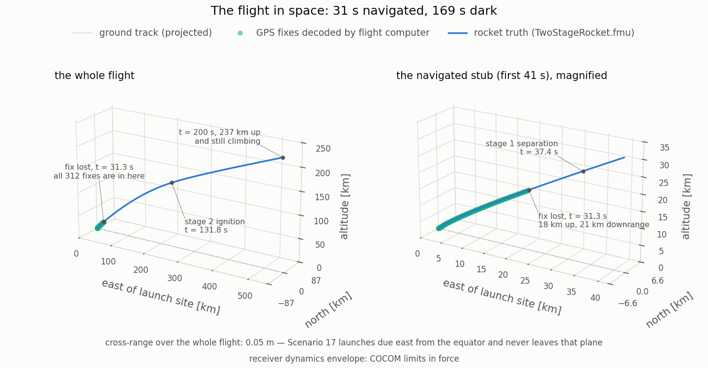

   The flight in space, and the fraction of it the receiver navigated. Every
   other GPS figure on this page plots against time, where the dropout is a
   shaded band of a certain width. Here it is a *distance*: the flight
   computer's entire GNSS record is the stub at the origin — 21 km downrange,
   18 km up — of a trajectory that runs 543 km downrange and 237 km up inside
   the 200 s window. Stage 1 separation, the 94 s coast, stage 2 ignition and
   burnout all happen in the unnavigated part.

   Hence two panels: on the overview the navigated portion is 4 % of the track
   and about twenty pixels wide, so it cannot be drawn as a distinguishable
   segment — the fix cloud marks its own extent instead, and the magnified
   panel is where the 312 fixes are actually separable from the truth line
   they sit on.

   The north axis is drawn even though nothing happens on it. Scenario 17
   launches due east from the equator and never manoeuvres, so the whole flight
   lies in one plane to within **0.05 m over 543 km** — and an axis carrying
   5 cm of data cannot be auto-scaled, or matplotlib magnifies the numerical
   dust into a cross-range wander that is not there. It is fixed to a share of
   the downrange extent and annotated with the real figure, on the principle
   that the honest thing to do with an empty dimension is show that it is empty
   rather than quietly project it away.

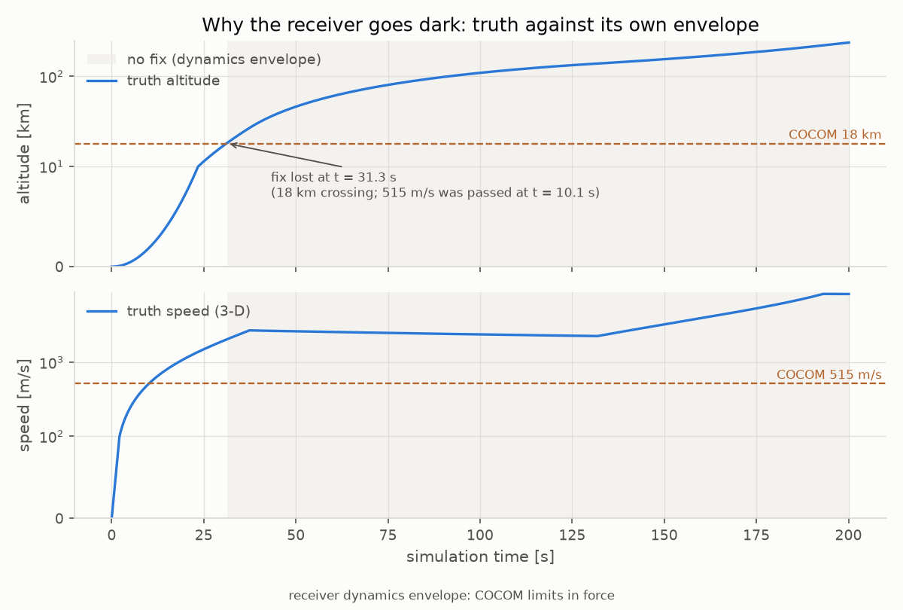

   Altitude and speed against the export thresholds, with every epoch the
   receiver reported no solution shaded. The **AND** is the whole point: the
   vehicle passes 515 m/s at t = 10.1 s and nothing happens, because it is
   only 2 km up; the fix goes when it crosses 18 km at t = 31.2 s already
   doing 2 km/s, and from there both conditions hold to the end of the flight.
   That is why the answer is 31.2 s and not 10.1 s.

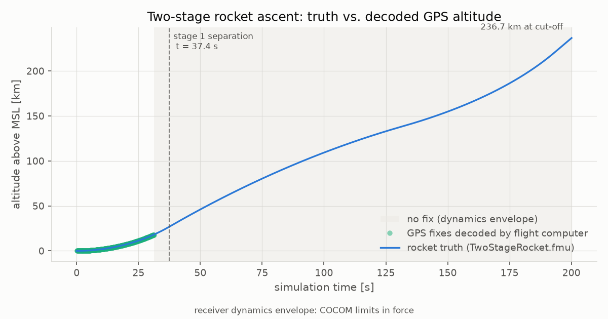

   Truth altitude and the fixes the flight software decoded. The fixes stop at
   18 km and the shading takes over for the remaining 169 s — the same story as
   the figure above, told in the data the flight software actually received
   rather than in the limits that produced it.

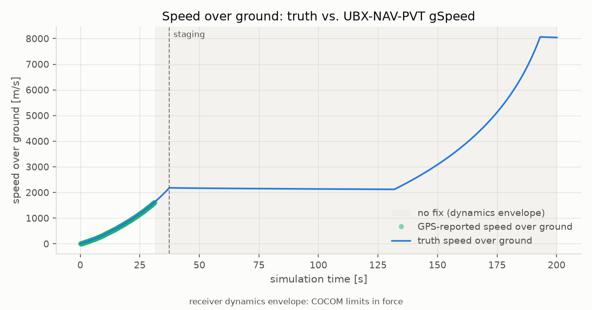

   Speed over ground: truth vs. the NAV-PVT ``gSpeed`` field the parser
   recovered. The receiver goes quiet at 1.6 km/s, well before staging, and
   never sees the 8 km/s the vehicle reaches on stage 2.

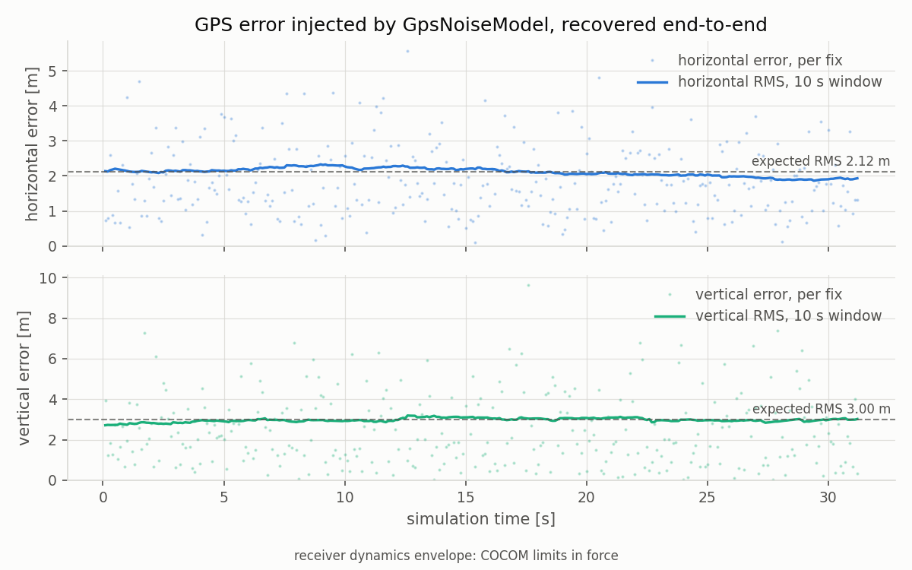

   Decoded-fix error against truth: every fix as a faint point, with a 10 s
   rolling RMS over it. One panel per component, because the two have different
   scales and whichever was drawn second simply hid the other.

   The RMS lines are the check. ``GpsNoiseConfig`` injects 1.5 m 1-sigma
   independently into north and east, so the *magnitude* of the horizontal
   error has RMS :math:`1.5\sqrt{2} = 2.12` m; vertical is a single axis at
   3 m. Both lines sit on those values — the error the flight software sees is
   *exactly* the error that was injected, with no distortion added by the
   encode/transmit/parse chain. Note the x-axis: this is the 31 s of fixes the
   export limits leave, and it is the whole of what a COCOM-limited receiver
   gives you to characterise.

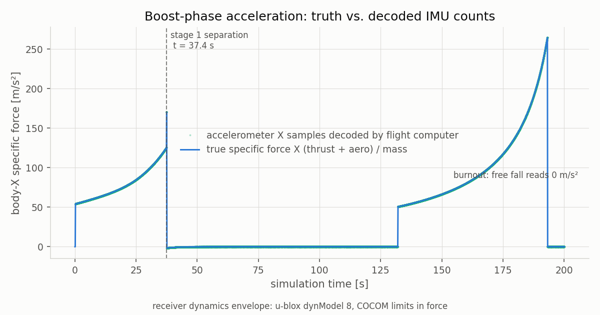

   Body-X specific force: truth (thrust + aero over mass) vs. the samples the
   flight software burst out of the part's FIFO and converted from raw
   register counts. The whole Scenario 17 profile is legible in it — stage 1
   from 54 m/s² up to 125 m/s² as propellant burns off, **exactly zero through
   the 94 s coast**, stage 2 lighting at 131.8 s and climbing to 265 m/s² at
   burnout, then zero again. Free fall reads zero because an accelerometer
   does not sense gravity. This figure is from the *default* run, the one whose
   GPS is dark throughout: the SPI sample stream is entirely unaffected by what
   the receiver is doing, which is rather the point of carrying an IMU.

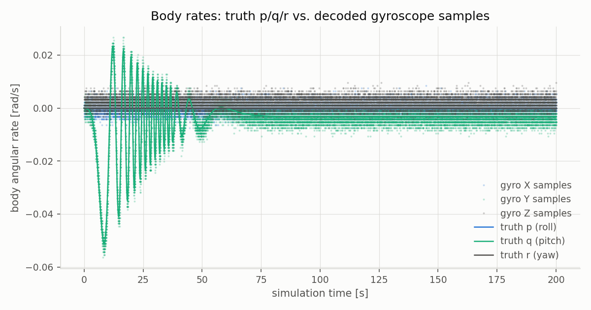

   Body rates: the damped pitch-rate oscillation during atmospheric flight is
   tracked by the decoded gyro-Y samples; the horizontal banding in the
   sample cloud is the gyroscope's LSB quantization (1 count ≈ 0.0011 rad/s
   at ±2000 °/s full scale) resolving the configured noise floor —
   register-level realism the flight software has to live with on the real
   part too.

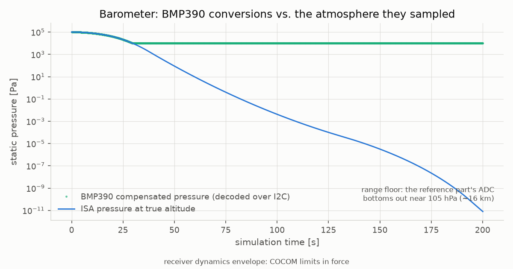

   The BMP390 channel: compensated pressure decoded by the on-target
   ``Bmp390Driver`` over the simulated I2C bus, against the ISA pressure at
   the true altitude. The samples are produced by *inverting the real Bosch
   compensation polynomial* in the FMU and recovered by running it forward in
   the driver, with the calibration coefficients travelling as the 21 NVM
   bytes a physical part serves — so agreement here is agreement between two
   executions of the same arithmetic across a register interface, not between
   a model and its copy. The flatline is the reference part's ADC bottoming
   out near 105 hPa.

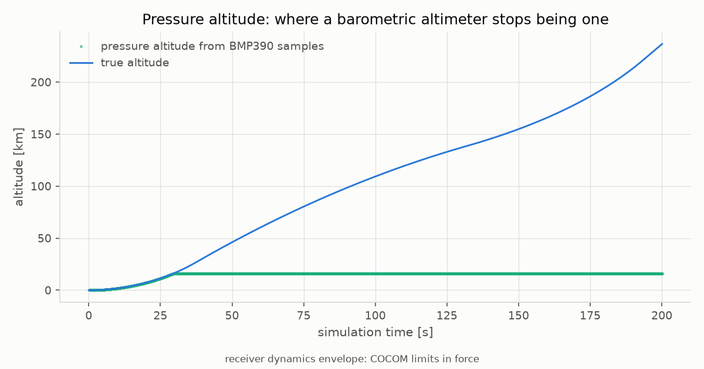

   The same samples inverted through the ISA, which is what flight software
   does with a static-pressure measurement. The altimeter is honest to
   ~16 km and then stops being an altimeter while the vehicle climbs another
   220 km — the barometric equivalent of the GPS figure's COCOM cut-off, and
   the reason a launch vehicle carries all three sensors at once. Each sample
   is timestamped from the part's own ``SENSORTIME`` counter, read in the
   same shadowed burst as the data registers.

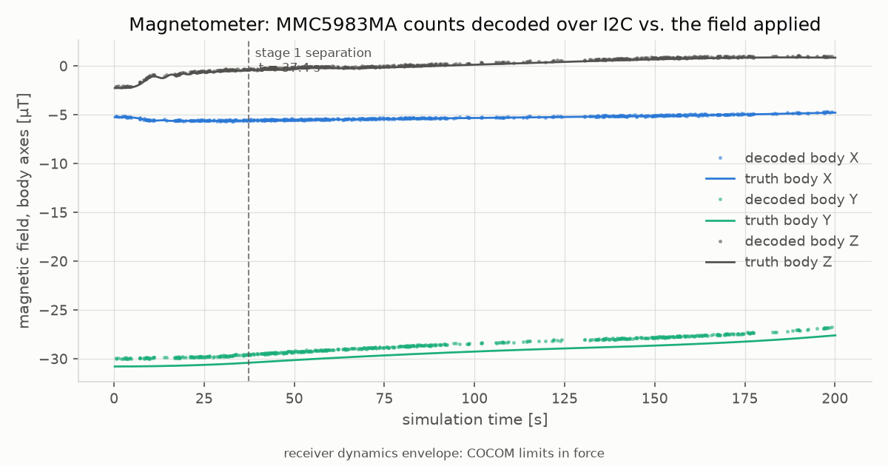

   The magnetometer channel: body-frame field decoded by the on-target
   ``Mmc5983maDriver`` over the simulated I2C bus, against the field the FMU
   was handed. The three axes are doing three different things — body Y
   carries almost the whole field because the vehicle flies due east across a
   mostly-northward one, while X and Z hold the small residue as it pitches
   over — which is exactly the geometry a swapped axis or a sign error would
   destroy, and exactly what a magnitude plot would hide. The constant gap
   between samples and truth is the simulated part's **hard iron**: a real
   field the installation adds, which no amount of SET/RESET removes.

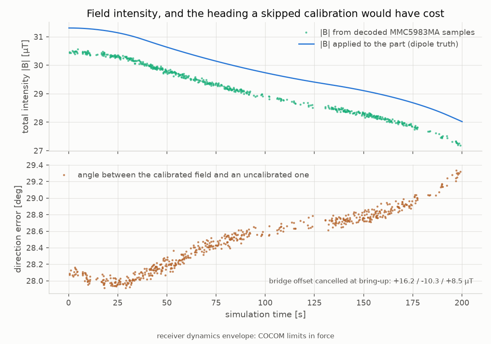

   Top: total intensity, the near-rotation-invariant quantity, so this panel
   is about the flight rather than the attitude — the field weakens as the
   vehicle climbs (1/r³ over 236 km) and shifts as it flies 2000 km east
   relative to the tilted dipole axis.

   Bottom: what skipping the SET/RESET calibration would have cost, drawn
   from the same samples with the measured bridge offset added back — **28–29°
   on this run**, and tens of degrees on any run, since the offset is redrawn
   each time from the datasheet's ±0.5 gauss tolerance. The first version of
   this figure plotted the uncalibrated
   *magnitude* and the two curves nearly coincided — which is true, and is
   precisely why magnitude is the wrong place to look: adding an offset the
   size of Earth's field to a field that size barely changes the length of the
   vector while swinging its direction most of a right angle. Heading is what
   a magnetometer is for, so the angle is the honest measure of the damage.

One detail matters when comparing fixes against truth: the Ecos master
propagates connections *between* steps, so the fix emitted at the end of step
*k* carries the truth sampled at the end of step *k−1* — one communication
step (0.1 s) of transport delay, just like a real receiver's navigation-epoch
latency. At 7 km/s that step is ~700 m of along-track motion, so the error
plot aligns each fix with the truth one step earlier; naive equal-timestamp
alignment would show latency, not receiver error. (The IMU plots need no such
realignment: the truth CSV's ``f_x/f_y/f_z`` columns are the ``imu::`` input
variables themselves — already the zero-order-held, one-step-delayed value
the FMU actually sampled.)

Implementation notes
--------------------

Where the FMI plumbing lives
~~~~~~~~~~~~~~~~~~~~~~~~~~~~

None of the sensor FMUs implements the FMI interface itself. Each ``fmu_main.cpp``
derives one class from ``fmu4cpp::fmu_base``, registers its variables by name
and implements ``do_step()``; the vendored fmu4cpp export layer
(:file:`vendor/fmu4cpp/`) supplies the entry points, and ``generateFMU()``
(:file:`cmake/generate_fmu.cmake`) generates ``modelDescription.xml`` by
loading the freshly built shared library and asking it to serialise its own
variables.

That removes two whole classes of hazard the FMU loader Ecos uses (`fmi4c
<https://github.com/Ecos-platform/fmi4c>`_) is strict about, and which a
hand-written export had to handle by hand:

* fmi4c resolves the **complete FMI 2.0 export table** up front and refuses to
  load a binary that omits any function — including the state-management and
  derivative functions whose capability flags are ``false``. fmu4cpp exports
  the full table unconditionally, so there are no stubs to forget.
* the model description and the binary can no longer disagree. The GUID is
  derived from the model metadata rather than pasted into two files, and
  ``fmi2Instantiate`` still rejects a mismatch, so a stale archive fails loudly
  at load time instead of running against the wrong variable list. (fmi4c's XML
  parser, ezxml, also rejects ``--`` inside XML comments — legitimately, per the
  XML specification — which used to constrain the hand-written
  ``model_description.xml`` comment style. Generated descriptions carry no
  comments at all.)

Both are good conformance pressure: any strict FMI master would be within its
rights on either count.

Ecos on Windows, cross-drive paths
~~~~~~~~~~~~~~~~~~~~~~~~~~~~~~~~~~

``simulation_structure::add_model`` has a ``std::filesystem::path`` overload
that internally converts the path with ``std::filesystem::relative()``. On
Windows that yields an *empty* path when the FMU lives on a different drive
than the working directory (e.g. FMU on ``C:``, build tree on ``D:``), so the
example passes plain absolute-path *strings*, which Ecos' file resolver
handles as-is.

.. _rocket_gps_ecos_pacing:

Pacing: why ``--rtf 1`` matters to the IMU
~~~~~~~~~~~~~~~~~~~~~~~~~~~~~~~~~~~~~~~~~~

Unpaced (the default, ``--rtf 0``) this co-simulation is not uniformly fast:
powered, in-atmosphere flight costs real time — DAVE-ML aero table lookups on
every implicit Radau stage — while thin air and coasting are cheap, so parts of
the run go far faster than others. The IMU FMU keeps latching ten samples per
step throughout, and where the master accelerates it can outrun the flight
computer's poll loop by more than the loop recovers from: a measured unpaced
run overran the part's 16 KiB FIFO and lost a few hundred samples out of
20 010. The sticky overflow bit reported it, and the frames that survived were
still frames — whole ones, correctly parsed — because the FIFO never accepts a
partial write.

That is worth seeing once, because it is a genuine property of the design: a
FIFO decouples a consumer from a producer *up to its depth*, and past that a
slow consumer loses samples and is told so. It is also an artifact of the
simulation, not of the system under test — on a vehicle the plant is the real
world and cannot outrun anything. ``--rtf 1`` removes it, and the reference run
above is lossless.

Two things about the shutdown path fell out of chasing that down, and both are
fixed rather than tolerated. ``terminate()`` now waits (bounded, and abandoned
if nobody is on the bus) for a controller to drain the FIFO before the
peripheral powers down — a real part answers chip select until the board loses
power, so the sample stream should end where the simulation does, not wherever
the last poll landed. And the flight computer drains its UDP socket after the
loop exits, since the IMU powering down is what ends that loop while the last
NAV-PVT datagrams are still queued in the kernel. Before those, an unpaced run
truncated both streams several seconds early and dropped 78 GPS epochs.

Two ways to measure your own logging instead of your system
~~~~~~~~~~~~~~~~~~~~~~~~~~~~~~~~~~~~~~~~~~~~~~~~~~~~~~~~~~~

Both of these were found by looking at a figure and asking why a number was
the value it was, and both had produced entirely plausible-looking output.

**The truth log was quantised at 6.4 m.** Ecos' ``csv_writer`` formats reals
with a default-configured ostringstream — six decimal places. For metres that
is sub-micron and fine; but the rocket reports geodetic position in *radians*,
where the sixth decimal is 6.4 m on the ground. The decoded-fix error figure
was therefore comparing 1.5 m-noise fixes against a reference rounded to four
times that, and its horizontal RMS read 2.81 m instead of 2.12 m — the excess
being exactly the :math:`6.37/\sqrt{12} = 1.84` m RMS of uniform rounding on
the longitude axis, the latitude axis being unaffected because Scenario 17
launches from the equator and its latitude rounds to zero cleanly.

``rocket_gps_cosim`` now writes the truth log itself, at
``max_digits10`` precision, through a small ``TruthLogger`` — it already read
every one of those properties each step for the specific-force computation, so
this costs nothing and puts the format under the example's control. The header
and separator deliberately match ``csv_writer``'s, so nothing downstream
needed a special case.

**No-fix epochs carried numbers that were not measurements.** A real receiver
keeps filling NAV-PVT's position and velocity fields through a dropout, and
``UbxParser`` faithfully decodes whatever is in them — but with the envelope in
force that is 2000 epochs of meaningless coordinates in the log, one
``read_fixes`` filter away from being plotted as a trajectory. The flight
computer now writes those epochs with **empty** position fields: the row
survives, because its index carries the time mapping and ``fix_type`` marks the
outage, but there is no data in it to misread.

Timing model
~~~~~~~~~~~~

One NAV-PVT frame is emitted per communication step, so the flight computer
maps *epoch* index → simulation time when logging (``--fix-period``, default
0.1 s). Epoch, not fix: the receiver keeps emitting through a dynamics-envelope
dropout, so counting only valid fixes would shift every later timestamp by the
length of the outage. When the master runs faster than real time, wall-clock
arrival times are meaningless; the index mapping is exact as long as no
datagram is dropped, and the summary line makes loss visible (decoded counts
vs. the master's step count). IMU samples carry the simulation clock in their
payload instead, so their timestamps come straight off the wire — which is
also what makes the SPI path timing-insensitive: a controller that polls late
gets older samples, correctly stamped, not wrong ones. ``--rtf 1`` runs the
co-simulation paced to the wall clock, which makes the streams realistic
enough to demo live consumers.

A real IMU samples far faster than a 10 Hz co-simulation step, so the IMU FMU
buffers ``round(step × sample_rate_hz)`` frames per ``fmi2DoStep`` (default
100 Hz → 10 frames per step), each with a fresh noise draw and its own
timestamp. The truth inputs are zero-order-held across the step — the master
only exchanges variables at communication points — which is the honest
equivalent of oversampling a plant that is itself only resolved at the
communication rate. Decoupling the controller's poll rate from the sample rate
is exactly what the part's FIFO is for, on silicon and here alike.

The IMU on the same truth bus
~~~~~~~~~~~~~~~~~~~~~~~~~~~~~

The IMU FMU follows the pattern the GPS FMU established — truth in over FMI,
sensor-realistic bytes out the side channel — the BMP390 FMU carries it onto
a register-accurate I2C part, and the same pattern extends to any further
sensor (magnetometer, radar altimeter): a noise model and an emitter under
``modules/sensors/include/Hemerion/<sensor>/fmu/``, an on-target parser next
to the driver code, and a round-trip unit test proving the two stay
byte-compatible. The wire format is deliberately *not* UBX: the
Hemerion IMU frame has its own sync bytes (``0xA5 0x5A``), so an interleaved
GPS/IMU byte stream can never desync one parser into the other's frames, and
the payload is raw register counts — scale (±40 g, ±2000 °/s) is
*configuration* both ends know, exactly as with real silicon, not wire data.

What it does *not* share is the transport, and that boundary is drawn at the
part rather than at the FMU. An FMU models one physical component, and an IMU
chip genuinely is a sensing element *and* an SPI peripheral — one part number,
one datasheet. Splitting those into two FMUs would need a byte-stream variable
between them, which FMI 2.0 does not have (FMI 3.0's ``Binary`` type would,
but Ecos imports through fmi4c on the 2.0 path this example runs), and would
quantize the FIFO's contents to communication points for no gain.

So the separation lives one level down, in code the FMU composes rather than
contains:

* ``ImuSpiSlave`` is the datasheet — registers, FIFO, shift register — and
  names no transport;
* ``SpiPeripheralEndpoint`` (:file:`sim/spi_shm/`) is the board — bus naming,
  segment lifecycle, the service thread — and names no sensor. It binds a
  device model duck-typed through the ``SpiShiftable`` concept, so any future
  SPI part gets onto a bus by declaring a member;
* ``fmu_main.cpp`` is the part number: which device model, on which bus, plus
  the FMI variables and the physics feeding it. It mentions no shared-memory
  type at all.
