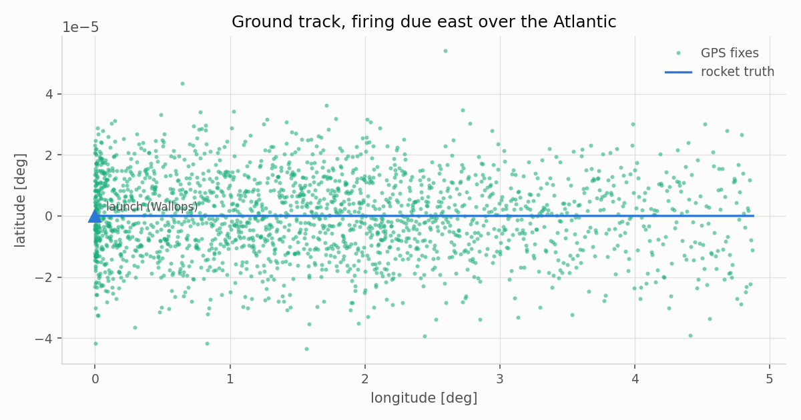

.. ------------------------------------------------------------------------------
.. Project: Hemerion Copyright (c) 2026, Onur Tuncer, PhD, Istanbul Technical University
..
.. SPDX-License-Identifier: GPL-3.0-only
.. License-Filename: LICENSE
.. ------------------------------------------------------------------------------

.. _rocket_gps_ecos_cosim:

Rocket → GPS + IMU → Flight Software Co-Simulation (``examples/rocket_gps_ecos``)
=================================================================================

``examples/rocket_gps_ecos`` couples four independently developed pieces into
one sensor-in-the-loop scenario, orchestrated by the
`Ecos <https://github.com/Ecos-platform/ecos>`_ FMI co-simulation platform:

1. **Aetherion's two-stage rocket plant** (``TwoStageRocket.fmu``) supplies the
   *truth* trajectory — a 6-DoF rocket (NASA TM-2015-218675 Scenario 17:
   DAVE-ML aero/propulsion/inertia tables, J2 gravity, stage separation)
   integrated with a Radau IIA RKMK scheme on SE(3).
2. **Hemerion's GPS hardware-simulator FMU** (``hemerion_gps_fmu.fmu``, from
   ``modules/sensors``) turns that truth into what a real u-blox M9N would
   report: Gaussian position/velocity noise plus the receiver's self-reported
   accuracies, gated through the receiver's **dynamics envelope** — an
   airborne <4 g platform model with the COCOM export limits in force — and
   encoded as **wire-exact UBX-NAV-PVT frames** sent over UDP, one frame per
   co-simulation step whether or not that frame carries a solution.
3. **Hemerion's IMU hardware-simulator FMU** (``hemerion_imu_fmu.fmu``, also
   from ``modules/sensors``) turns true body-frame specific force and angular
   rate into what a tactical-grade MEMS part would latch: per-run turn-on bias
   plus white noise, quantized to **16-bit register counts** (±40 g /
   ±2000 °/s sensitivity) and framed as Hemerion IMU raw-sample packets into
   the part's **sample FIFO** at 100 Hz — ten per co-simulation step. It does
   not send them anywhere: it is an **SPI peripheral**, and answers
   chip-select-framed transfers on a bus carried in shared memory.
4. **The flight software sensor stacks** (``gps_flight_computer``) drive both
   buses with the *unmodified* ``GpsDriver``/``UbxParser`` and
   ``ImuSpiDriver``/``ImuPacketParser``/``convert_raw_to_si()`` from
   ``modules/sensors`` — the same code the STM32H743 firmware cross-compiles.
   Only the two transport shims differ from the target: a UDP socket where the
   receiver's UART would be, and a shared-memory SPI bus where
   ``HAL_SPI_TransmitReceive`` plus the CS/DRDY GPIOs would be (or Renode's
   emulated peripherals, see :ref:`swil_windows_setup`).

.. code-block:: text

   ┌──────────────────────┐  FMI 2.0 variables    ┌──────────────────────┐  UBX-NAV-PVT    ┌────────────────────────┐
   │  TwoStageRocket.fmu  │  (Ecos connections)   │ hemerion_gps_fmu.fmu │  over UDP       │  gps_flight_computer   │
   │  Aetherion 6-DoF     ├──────────────────────>│ u-blox M9N simulator │────────────────>│  GpsDriver + UbxParser │
   │  rocket plant        │  lat, lon, alt,       │ noise + COCOM/4 g    │ 127.0.0.1:5762  │                        │
   │  (truth)             │  NED velocity         │ envelope + UBX enc.  │ 1 frame / step  │  ImuSpiDriver +        │
   │                      │                       └──────────────────────┘                 │  ImuPacketParser +     │
   │                      │  p/q/r (connections), ┌──────────────────────┐   SPI transfers │  convert_raw_to_si     │
   │                      │  specific force       │ hemerion_imu_fmu.fmu │<────────────────┤                        │
   │                      ├──────────────────────>│ MEMS IMU simulator:  │  over shared    │  (the code the STM32   │
   │                      │  (host-computed)      │ bias + noise + regs  │──────  memory ─>│  H743 firmware runs)   │
   └──────────────────────┘                       │ + 16 KiB sample FIFO │  bursts of      │                        │
            │                                     └──────────────────────┘  raw counts     └────────────────────────┘
            └───────────── rocket_gps_cosim: Ecos master, fixed step 0.1 s (10 Hz GPS, 100 Hz IMU) ────────┘

The two arrow directions are the point. The receiver *talks*; the IMU is
*polled*. Modelling both as byte streams pushed at the flight computer would
have exercised the packet parsers and nothing else — no register map, no
FIFO, no chip select, none of the sequence firmware actually runs against an
inertial part.

.. contents:: On this page
   :local:
   :depth: 2

---

Signal wiring
-------------

``rocket_gps_cosim`` builds the coupling with Ecos' C++ API
(``simulation_structure``). The rocket reports geodetic position in
**radians**; the GPS FMU takes **degrees**, so the two conversions ride on the
Ecos connections as modifiers. Velocity is wired 1:1 into the GPS FMU's NED
inputs, from which it derives speed-over-ground and course itself. Body rates
wire 1:1 into the IMU FMU:

.. list-table::
   :header-rows: 1
   :widths: 34 32 34

   * - ``TwoStageRocket`` output
     - Ecos connection modifier
     - Sensor FMU input
   * - ``out.lat_rad``
     - rad → deg
     - ``gps::latitude_deg``
   * - ``out.lon_rad``
     - rad → deg
     - ``gps::longitude_deg``
   * - ``out.alt_m``
     - —
     - ``gps::altitude_m``
   * - ``out.v_north_m_s``
     - —
     - ``gps::v_north_mps``
   * - ``out.v_east_m_s``
     - —
     - ``gps::v_east_mps``
   * - ``out.v_down_m_s``
     - —
     - ``gps::v_down_mps``
   * - ``out.p_rad_s``
     - —
     - ``imu::p_rad_s``
   * - ``out.q_rad_s``
     - —
     - ``imu::q_rad_s``
   * - ``out.r_rad_s``
     - —
     - ``imu::r_rad_s``

In code:

.. code-block:: cpp

    ecos::simulation_structure ss;
    ss.add_model("rocket", options.rocket_fmu.string());
    ss.add_model("gps", options.gps_fmu.string());
    ss.add_model("imu", options.imu_fmu.string());

    const std::function<double(const double&)> rad2deg =  {
      return rad * (180.0 / std::numbers::pi);
    };
    ss.make_connection<double>("rocket::out.lat_rad", "gps::latitude_deg", rad2deg);
    ss.make_connection<double>("rocket::out.lon_rad", "gps::longitude_deg", rad2deg);
    ss.make_connection<double>("rocket::out.alt_m", "gps::altitude_m");
    ss.make_connection<double>("rocket::out.v_north_m_s", "gps::v_north_mps");
    ss.make_connection<double>("rocket::out.v_east_m_s", "gps::v_east_mps");
    ss.make_connection<double>("rocket::out.v_down_m_s", "gps::v_down_mps");
    ss.make_connection<double>("rocket::out.p_rad_s", "imu::p_rad_s");
    ss.make_connection<double>("rocket::out.q_rad_s", "imu::q_rad_s");
    ss.make_connection<double>("rocket::out.r_rad_s", "imu::r_rad_s");

    const auto sim = ss.load(std::make_unique<ecos::fixed_step_algorithm>(0.1));
    sim->init("launchSite");

**Specific force** — what an accelerometer actually measures, the sum of the
non-gravitational forces over mass — has no direct rocket output, and it
involves three of them: :math:`\mathbf{f} = (F_{thrust}\hat{x} +
\mathbf{F}_{aero}) / m`. An Ecos connection modifier sees only its single
source variable, so the host computes ``f`` from ``out.thrust_N``,
``out.aero_F{x,y,z}_N`` and ``out.mass_kg`` after every step and writes the
IMU FMU's ``f_x/f_y/f_z_mps2`` inputs through Ecos properties — the same
one-communication-step transport delay a connection would have:

.. code-block:: cpp

    sim->step();
    const double m = mass->get_value();
    imu_fx->set_value((thrust->get_value() + aero_fx->get_value()) / m);
    imu_fy->set_value(aero_fy->get_value() / m);
    imu_fz->set_value(aero_fz->get_value() / m);

Neither sensor FMU has **FMI output variables**: their outputs are byte
streams, exactly like a real receiver's UART or a real IMU's data registers.
That keeps the firmware parsers exercised at the byte level — sync characters,
little-endian scaled integers, checksums and all — rather than handing the
flight software convenient floating-point values it would never see on the
vehicle. The IMU frames carry raw register counts; the flight software
converts them to SI with the same ±40 g / ±2000 °/s ``ImuScale`` the FMU
quantized with, standing in for a driver that knows the full-scale ranges it
configured into the part.

The receiver's configuration
----------------------------

The GPS FMU's dynamics envelope is what makes this scenario interesting, so
``rocket_gps_cosim`` writes it explicitly rather than inheriting the FMU's
defaults silently:

.. code-block:: cpp

    launch_site["gps::dynamic_platform"] = 8;      // u-blox dynModel: airborne <4 g
    launch_site["gps::cocom_limits_enabled"] = true;
    launch_site["gps::reacquisition_time_s"] = 2.0;

Those are the settings a launch vehicle actually ships with, and this vehicle
breaks all of them. Both mechanisms are evaluated against *truth*, not against
the noisy fix — it is the vehicle's real motion that breaks carrier tracking,
not the receiver's estimate of it:

* the **platform model** declares 80 km, 500 m/s horizontal, 100 m/s vertical
  and 4 g; the vehicle passes 500 m/s horizontal during first-stage boost;
* the **COCOM export limits** stop navigation output above 18 000 m *and*
  515 m/s — an AND, which is why a high-altitude balloon and a fast low sled
  both keep their fix and a sounding rocket past first-stage burnout does not;
* recovery is not instantaneous either: the fix stays invalid for
  ``reacquisition_time_s`` after the vehicle re-enters the envelope, standing
  in for the tracking loops re-acquiring.

When either trips, the fix is degraded in place — fix type drops to ``kNoFix``
so ``UbxEmitter`` clears NAV-PVT's ``gnssFixOK`` flag, satellite count goes to
zero, accuracies inflate — and the frame is still emitted. Position and
velocity fields keep carrying the invalid solution, as on a real receiver, and
consumers are expected to gate on the fix type. ``gps_flight_computer`` does,
logs the epoch anyway with its ``fix_type`` column, and reports the window;
``plot_results.py`` drops no-fix epochs rather than plotting position fields
that mean nothing.

``--dyn-model -1 --no-cocom`` reproduces an unrestricted stream — a waivered,
envelope-unlocked receiver — for comparison.

Driving the IMU over SPI
------------------------

The IMU side has no stream to receive. ``gps_flight_computer`` runs the
on-target ``ImuSpiDriver`` against the simulated part, and the sequence is the
one the firmware's IMU task performs:

.. code-block:: cpp

    ImuSpiDriver imu_driver(imu_bus);          // imu_bus: the only host-specific piece
    imu_driver.probe();                        // WHO_AM_I, then CONTROL = FIFO enable | reset

    while (imu_driver.data_ready())            // the part's DRDY line
    {
      const auto result = imu_driver.poll(batch.data(), batch.size());
      // -> reads STATUS + FIFO_COUNT in one 4-byte transfer,
      //    bursts the FIFO port, feeds every byte to ImuPacketParser
    }

``ImuSpiBus`` is the whole difference between running that here and running it
on the STM32: one chip-select-framed transfer, and a read of the data-ready
pin. On the host it wraps :file:`sim/spi_shm`'s controller; on the target it
wraps ``HAL_SPI_TransmitReceive`` between two GPIO writes. The register map,
the FIFO semantics and the byte-level parsing are the same object code either
way — see :ref:`imu_spi_interface` for the part's registers and what the
handshake granularity does and does not model.

Two consequences worth knowing when reading a run:

* ``probe()`` writes ``FIFO_RESET``, so any samples the FMU buffered before
  the flight computer attached are discarded — a driver clearing whatever
  accumulated before it took over. Start the flight computer first (it waits
  for the bus) and nothing is lost.
* the part's FIFO is 16 KiB, about 420 frames or four seconds at 100 Hz. A
  controller slower than that loses whole samples, never framing, and finds
  out through the sticky overflow bit, which the summary line reports.

Building
--------

Requires a native toolchain, network access at configure time (Ecos and its
FMU loader fmi4c are fetched and built from source), and an Aetherion install
for ``TwoStageRocket.fmu`` (set ``AETHERION_ROOT`` if it is not in a default
location; without it the example still builds and ``--rocket <path>`` selects
the FMU at runtime):

.. code-block:: console

   $ cmake --preset examples-native
   $ cmake --build build/examples-native

Besides the two example executables this also produces
``hemerion_gps_fmu.fmu`` and ``hemerion_imu_fmu.fmu`` under
``build/examples-native/fmus/``. ``generateFMU()``
(:file:`cmake/generate_fmu.cmake`) builds each simulator against the vendored
fmu4cpp export layer, generates its ``modelDescription.xml`` from the
variables the model registers, and zips the result into a proper archive
(``modelDescription.xml`` at the archive root, the shared library under
``binaries/<platform>/``) as a post-build step of the per-version targets.

Both FMI generations are exported from the same sources: ``fmus/fmi2/``
(library under ``binaries/win64`` or ``binaries/linux64``) and ``fmus/fmi3/``
(``binaries/x86_64-windows`` or ``binaries/x86_64-linux``). **This example
uses the FMI 2.0 pair** — Ecos imports through fmi4c — and the paths compiled
into ``rocket_gps_cosim`` point there.

Running
-------

Two terminals, both in ``build/examples-native/examples/rocket_gps_ecos/``.
Start the flight computer first: it binds the GPS FMU's UDP destination
(5762), then waits (``--imu-wait-s``, default 120 s) for the IMU's SPI bus to
appear, so the two processes may be started in either order. Starting it first
is still preferable — a controller that probes after the FMU has begun
stepping resets the part's FIFO and discards whatever was buffered before it
took over.

.. code-block:: console

   $ ./gps_flight_computer          # terminal 1 — the "STM32" side
   $ ./rocket_gps_cosim             # terminal 2 — the Ecos master

The default flight is Scenario 17's own 200 s window at a 0.1 s communication
step — a 10 Hz GPS navigation rate. Stage 1 burns out and separates at
t = 37.4 s, the vehicle **coasts for 94 s**, stage 2 ignites at t = 131.8 s and
burns out at t = 193 s, and the run ends 7 s later with the vehicle at 236 km
and still climbing: this is a rocket *to orbit*, so there is no apogee inside
the window. ``--rtf 1`` paces the master to wall-clock speed; the transcripts
and figures on this page come from such a run, and
:ref:`rocket_gps_ecos_pacing` explains why it matters for the IMU.

.. warning::

   Those event times are not free — they have to be *configured*, and getting
   them wrong is silent. The ``TwoStageRocket`` FMU's ``stg2.ignition_time_s``
   parameter defaults to 0, meaning "ignite stage 2 the moment stage 1
   separates". That is a different mission: continuous thrust to t = 99 s, no
   coast, and 638 km of altitude at t = 200 s against the reference's 234–251 km.
   This example ran that way until it was checked. ``rocket_gps_cosim`` now
   sets ``stg2.ignition_time_s`` explicitly and
   :ref:`verifies the result <rocket_gps_ecos_verification>` against the
   published check-case trajectory.

The bus name is shared configuration: the FMU creates
``hemerion_imu_spi`` unless ``HEMERION_IMU_FMU_SPI_BUS`` says otherwise, and
the flight computer attaches to whatever ``--imu-bus`` names. Set both to run
two co-simulations side by side on one machine.

.. note::

   Ecos unzips each ``.fmu`` by shelling out to ``tar``. On Windows with Git
   for Windows ahead of ``System32`` on ``PATH``, that resolves to GNU tar,
   which reads ``C:\...`` as *host* ``C:`` plus path and fails with
   ``tar: Cannot connect to C: resolve failed``. Put ``C:\Windows\System32``
   first so the bundled bsdtar wins.

Ecos master console
~~~~~~~~~~~~~~~~~~~

.. code-block:: text

   [cosim] rocket: C:\dev\Aetherion\out\build\windows-release\models\fmi2\TwoStageRocket\TwoStageRocket.fmu
   [cosim] gps:    C:/dev/Hemerion/build/examples-native/fmus/fmi2/hemerion_gps_fmu.fmu
   [cosim] imu:    C:/dev/Hemerion/build/examples-native/fmus/fmi2/hemerion_imu_fmu.fmu
   [cosim] step 0.1 s (10 Hz GPS, 100 Hz IMU), stop 200 s
   [cosim] plant: launch 0 deg N / 0 deg E at 0 m, stage 2 ignition at t=131.8 s
   [cosim] receiver: dynModel 8, COCOM limits in force (18000 m AND 515 m/s), re-acquisition 2 s
   [cosim] t=10 s  alt=1826.71 m  mach=1.52891  mass=265846 kg
   [cosim] t=20 s  alt=7249.12 m  mach=3.63603  mass=217693 kg
   [cosim] t=30 s  alt=16639.8 m  mach=6.52317  mass=169539 kg
   [cosim] t=37.4 s  stage 1 separated
   [cosim] t=40 s  alt=30874.2 m  mach=8.87282  mass=98905.9 kg
   [cosim] t=50 s  alt=46086.3 m  mach=8.00648  mass=98905.9 kg
   ...
   [cosim] t=130 s  alt=137088 m  mach=8.23193  mass=98905.9 kg
   [cosim] t=140 s  alt=145338 m  mach=9.68307  mass=88316.5 kg
   ...
   [cosim] t=190 s  alt=213472 m  mach=27.7983  mass=22949.7 kg
   [cosim] t=200 s  alt=236494 m  mach=30.3804  mass=18897 kg
   [cosim] done: 2001 steps, 2001 UBX-NAV-PVT frames emitted and 20010 IMU samples buffered for the SPI controller
   [cosim] max altitude 236729 m at t=200.1 s, staging at t=37.4 s
   [cosim] rocket truth written to results/rocket_truth.csv

Constant mass from t = 37.4 s to t = 140 s is the coast; Mach *falling* through
it while altitude climbs is the vehicle decelerating in thinning air.

Flight computer console
~~~~~~~~~~~~~~~~~~~~~~~

Every 50th decoded fix and every 1000th decoded IMU sample is printed; the
data is what the *sensors* report — truth plus the injected noise — decoded
from raw bytes:

.. code-block:: text

   [fc] listening for UBX-NAV-PVT on UDP port 5762 (GpsDriver, protocol=UBX)
   [fc] waiting up to 120 s for the IMU on SPI bus 'hemerion_imu_spi'
   [fc] IMU identified on SPI (WHO_AM_I matched), FIFO enabled
   [fc] fix     1  t=    0.1 s  lat=  0.0000144  lon=   0.0000198  alt=      0.2 m  vel=    0.1 m/s  crs=148.9 deg  sats=11
   [fc] fix     2  t=    0.2 s  NO FIX -- receiver outside its dynamics envelope
   [fc] imu      1  t=    0.1 s  f=[   54.27   -0.09   -0.05] m/s2  w=[  0.0011  0.0000  0.0000] rad/s
   [fc] imu   3000  t=   30.1 s  f=[   97.82    0.02   -0.09] m/s2  w=[  0.0032 -0.0202  0.0032] rad/s
   [fc] imu   4000  t=   40.1 s  f=[   -0.86   -0.04   -0.15] m/s2  w=[  0.0000  0.0000  0.0043] rad/s
   [fc] imu  10000  t=  100.1 s  f=[   -0.06    0.07    0.07] m/s2  w=[ -0.0011 -0.0043  0.0011] rad/s
   [fc] imu  14000  t=  140.1 s  f=[   56.62   -0.02   -0.09] m/s2  w=[  0.0011 -0.0021  0.0011] rad/s
   [fc] imu  19000  t=  190.1 s  f=[  217.87    0.02    0.02] m/s2  w=[ -0.0011 -0.0011  0.0021] rad/s
   [fc] imu  20000  t=  200.1 s  f=[    0.00   -0.01   -0.06] m/s2  w=[  0.0053 -0.0021  0.0011] rad/s
   [fc] IMU powered down (FMU terminated) -- co-simulation finished
   [fc] summary: 2001 NAV-PVT epochs decoded (0 checksum errors), 1 carried a fix, 2000 did not
   [fc] no-fix window: t=0.2 s to t=200.1 s (receiver dynamics envelope: platform model + COCOM limits)
   [fc] 20000 IMU samples decoded over 14396 SPI transfers (0 checksum errors, 0 FIFO overflows, 0 failed transfers)
   [fc] max altitude 0.247 m, max ground speed 0.085 m/s (fixes the receiver actually reported)
   [fc] max |specific force| 264.657 m/s2, max |body rate| 0.0566544 rad/s
   [fc] fixes written to results/gps_fixes.csv, IMU samples to results/imu_samples.csv

Read the GPS line again: **one fix, out of 2001 navigation epochs.** The
receiver reports a solution on the pad, loses it 0.1 s later, and never gets it
back. That is not a bug in the model — it is what a stock COTS receiver does
to a launch vehicle, and it is the single most useful thing this example has to
say. The 4 g platform acceleration limit trips on the second epoch (thrust
alone is ~54 m/s², so coordinate acceleration is ~4.6 g off the pad); by the
time the vehicle has decelerated into that envelope it is past 18 km and
515 m/s, where COCOM takes over; and past 80 km the platform model's altitude
ceiling holds it dark for the rest of the flight. Flight software that assumes
GNSS through boost has just been shown otherwise.

The IMU line is the other half: **20000 of 20010 samples decoded, zero
checksum errors, zero FIFO overflows, zero failed transfers**, across 14396
chip-select-framed SPI transfers. The ten missing samples are the ones the FMU
buffered before the flight computer probed — ``probe()`` writes ``FIFO_RESET``,
exactly as a driver clearing whatever accumulated before it took over. Every
NAV-PVT frame the receiver emitted was decoded too (2001 of 2001), fix or no
fix. The whole chain from 6-DoF truth through both noise models, both encoders,
both transports and the on-target drivers is lossless and wire-correct.

The mission profile reads straight off the decoded IMU stream, which is the
cheapest sanity check there is on the plant: 54 m/s² at lift-off climbing to
125 m/s² as stage 1 burns off its propellant, **zero through the 94 s coast**
(t = 40.1 s and t = 100.1 s both read ~0), 57 m/s² when stage 2 lights, 218 m/s²
by t = 190 s, and zero again after burnout. An accelerometer does not sense
gravity, so free fall reads zero however fast the vehicle is actually
accelerating toward the Earth.

For comparison, the same flight with ``--dyn-model -1 --no-cocom`` — a
waivered, envelope-unlocked receiver:

.. code-block:: text

   [cosim] receiver: dynModel -1, COCOM limits disabled, re-acquisition 2 s
   ...
   [fc] summary: 2001 NAV-PVT epochs decoded (0 checksum errors), 2001 carried a fix, 0 did not
   [fc] 20000 IMU samples decoded over 14339 SPI transfers (0 checksum errors, 0 FIFO overflows, 0 failed transfers)
   [fc] max altitude 236495 m, max ground speed 8065.02 m/s (fixes the receiver actually reported)

Four of the figures below need a fix stream to say anything at all, so they
come from that second run; ``plot_results.py`` skips them rather than drawing
them empty when the envelope leaves fewer than two usable epochs.

.. _rocket_gps_ecos_verification:

Checking the plant against the published trajectory
~~~~~~~~~~~~~~~~~~~~~~~~~~~~~~~~~~~~~~~~~~~~~~~~~~~

None of the above means anything if the truth driving the sensors is flying the
wrong mission — a plant with the wrong staging profile still produces perfectly
clean-looking GPS and IMU streams, which is exactly what makes the error easy
to miss. NASA TM-2015-218675 publishes check-case output for Scenario 17, and
Aetherion ships it under ``data/Atmos_17_TwoStageRocketToOrbit/``, so
``verify_trajectory.py`` checks the run against it:

.. code-block:: console

   $ python verify_trajectory.py \
       --reference <aetherion>/data/Atmos_17_TwoStageRocketToOrbit/Atmos_17_sim_04.csv \
       --reference <aetherion>/data/Atmos_17_TwoStageRocketToOrbit/Atmos_17_sim_05.csv \
       --reference <aetherion>/data/Atmos_17_TwoStageRocketToOrbit/Atmos_17_sim_06.csv
   compared 2001 samples of rocket_truth.csv against 3 reference(s): Atmos_17_sim_04.csv, Atmos_17_sim_05.csv, Atmos_17_sim_06.csv
     references disagree with each other by up to 16.97 km (at t = 200.0 s) -- the envelope is that wide
     t=  37.4 s  stage 1 burnout / separation    ours    26.77 km   reference    26.75..26.76 km
     t= 131.8 s  stage 2 ignition                ours   138.52 km   reference   138.24..138.34 km
     t= 193.0 s  stage 2 burnout                 ours   220.15 km   reference   217.97..230.00 km
   OK: every sample inside the reference envelope, within 1.0% + 100 m

The criterion is the **envelope** of the three published trajectories, not any
one of them. Those are three independent simulators run against the same case
and they do not agree with each other: at t = 200 s sim_04 and sim_05 report
251.4 km while sim_06 reports 234.5 km, a 7% spread. Checking against a single
one would be checking against that simulator's idiosyncrasies as much as
against the scenario, so the strongest claim the data supports is that the run
lies between them — which it does, at every one of 2001 samples, and within
20 m of all three at stage-1 burnout.

This is the check that caught the ``stg2.ignition_time_s`` default. Before it,
the same run was 638 km high at t = 200 s against a reference envelope topping
out at 251 km, and every sensor figure on this page looked entirely
plausible.

That losslessness is the property the SPI rework had to preserve, and it is
pinned by a test rather than by a transcript: ``test_imu_spi.cpp``
(``sensors.imu_spi`` under CTest) runs the real ``ImuSpiDriver`` against the
real ``ImuSpiSlave`` and asserts that the bytes burst out of the sample FIFO
are the bytes ``ImuPacketEmitter`` produced — including the case where a burst
lands mid-frame, which is the normal one, since a controller has no way to
align its reads to frame boundaries. ``spi_shm.link`` covers the bus itself:
the handshake, the byte-by-byte shifting, the data-ready line, and a
peripheral powering down under a controller mid-transfer.

Results
-------

``plot_results.py`` (matplotlib) renders the three CSVs — Ecos' truth log and
the flight computer's fix and IMU-sample logs — into the figures below:

.. code-block:: console

   $ python plot_results.py       # reads results/, writes plots/

.. figure:: _static/rocket_gps_ecos/gps_availability.png
   :width: 100%
   :alt: Two panels, altitude and speed against time on log axes, with the COCOM and platform-model thresholds marked and the whole flight shaded as a no-fix window

   **The default configuration, envelope in force.** Altitude and speed against
   the limits that took the fix away; the shading is every epoch the receiver
   reported no solution, which is all of them but the first. Neither threshold
   explains that first loss — the 4 g platform *acceleration* limit trips on
   the second navigation epoch, before the vehicle has cleared 20 m — but
   between them they explain why it never comes back: above 18 km *and*
   515 m/s the COCOM cut-off holds, and above 80 km so does the platform
   model's altitude ceiling. The remaining GPS figures need a fix stream, so
   they come from the ``--dyn-model -1 --no-cocom`` run.

.. figure:: _static/rocket_gps_ecos/altitude_vs_time.png
   :width: 100%
   :alt: Altitude vs time: truth line with decoded GPS fixes overlaid, staging marker at 37.4 s, 236 km at cut-off

   *Envelope-unlocked run.* Truth altitude and the fixes the flight software
   decoded. At this scale the two are indistinguishable — which is the point.

   *Envelope-unlocked run.* Ground track: Scenario 17 launches from the
   equator on the prime meridian and fires due east. ``--lat0``/``--lon0``
   move the pad, at the cost of no longer being comparable to the published
   check case.

.. figure:: _static/rocket_gps_ecos/velocity_vs_time.png
   :width: 100%
   :alt: Speed over ground vs time, truth and UBX-reported gSpeed, staging marker

   *Envelope-unlocked run.* Speed over ground: truth vs. the NAV-PVT
   ``gSpeed`` field the parser recovered. Stage 1 accelerates to ~2.4 km/s, the
   coast bleeds a little of it off against thinning air, and stage 2 takes the
   vehicle to ~8 km/s by burnout.

.. figure:: _static/rocket_gps_ecos/gps_error.png
   :width: 100%
   :alt: Horizontal and vertical decoded-fix error vs truth, flat noise band around the 1.5 m one-sigma line

   *Envelope-unlocked run.* Decoded-fix error against truth. The band is flat
   across three decades of altitude and speed and matches the configured
   receiver noise (``GpsNoiseConfig``: 1.5 m horizontal / 3 m vertical,
   1-sigma) — the error the flight software sees is *exactly* the error that
   was injected, with no distortion added by the encode/transmit/parse chain.

.. figure:: _static/rocket_gps_ecos/imu_specific_force.png
   :width: 100%
   :alt: Body-X specific force vs time: truth line with decoded accelerometer samples overlaid, staging marker, zero during coast

   Body-X specific force: truth (thrust + aero over mass) vs. the samples the
   flight software burst out of the part's FIFO and converted from raw
   register counts. The whole Scenario 17 profile is legible in it — stage 1
   from 54 m/s² up to 125 m/s² as propellant burns off, **exactly zero through
   the 94 s coast**, stage 2 lighting at 131.8 s and climbing to 265 m/s² at
   burnout, then zero again. Free fall reads zero because an accelerometer
   does not sense gravity. This figure is from the *default* run, the one whose
   GPS is dark throughout: the SPI sample stream is entirely unaffected by what
   the receiver is doing, which is rather the point of carrying an IMU.

.. figure:: _static/rocket_gps_ecos/imu_body_rates.png
   :width: 100%
   :alt: Body angular rates vs time: truth p/q/r lines with decoded gyroscope samples, damped pitch oscillation during boost

   Body rates: the damped pitch-rate oscillation during atmospheric flight is
   tracked by the decoded gyro-Y samples; the horizontal banding in the
   sample cloud is the gyroscope's LSB quantization (1 count ≈ 0.0011 rad/s
   at ±2000 °/s full scale) resolving the configured noise floor —
   register-level realism the flight software has to live with on the real
   part too.

One detail matters when comparing fixes against truth: the Ecos master
propagates connections *between* steps, so the fix emitted at the end of step
*k* carries the truth sampled at the end of step *k−1* — one communication
step (0.1 s) of transport delay, just like a real receiver's navigation-epoch
latency. At 7 km/s that step is ~700 m of along-track motion, so the error
plot aligns each fix with the truth one step earlier; naive equal-timestamp
alignment would show latency, not receiver error. (The IMU plots need no such
realignment: the truth CSV's ``f_x/f_y/f_z`` columns are the ``imu::`` input
variables themselves — already the zero-order-held, one-step-delayed value
the FMU actually sampled.)

Implementation notes
--------------------

Where the FMI plumbing lives
~~~~~~~~~~~~~~~~~~~~~~~~~~~~

Neither sensor FMU implements the FMI interface itself. Each ``fmu_main.cpp``
derives one class from ``fmu4cpp::fmu_base``, registers its variables by name
and implements ``do_step()``; the vendored fmu4cpp export layer
(:file:`vendor/fmu4cpp/`) supplies the entry points, and ``generateFMU()``
(:file:`cmake/generate_fmu.cmake`) generates ``modelDescription.xml`` by
loading the freshly built shared library and asking it to serialise its own
variables.

That removes two whole classes of hazard the FMU loader Ecos uses (`fmi4c
<https://github.com/Ecos-platform/fmi4c>`_) is strict about, and which a
hand-written export had to handle by hand:

* fmi4c resolves the **complete FMI 2.0 export table** up front and refuses to
  load a binary that omits any function — including the state-management and
  derivative functions whose capability flags are ``false``. fmu4cpp exports
  the full table unconditionally, so there are no stubs to forget.
* the model description and the binary can no longer disagree. The GUID is
  derived from the model metadata rather than pasted into two files, and
  ``fmi2Instantiate`` still rejects a mismatch, so a stale archive fails loudly
  at load time instead of running against the wrong variable list. (fmi4c's XML
  parser, ezxml, also rejects ``--`` inside XML comments — legitimately, per the
  XML specification — which used to constrain the hand-written
  ``model_description.xml`` comment style. Generated descriptions carry no
  comments at all.)

Both are good conformance pressure: any strict FMI master would be within its
rights on either count.

Ecos on Windows, cross-drive paths
~~~~~~~~~~~~~~~~~~~~~~~~~~~~~~~~~~

``simulation_structure::add_model`` has a ``std::filesystem::path`` overload
that internally converts the path with ``std::filesystem::relative()``. On
Windows that yields an *empty* path when the FMU lives on a different drive
than the working directory (e.g. FMU on ``C:``, build tree on ``D:``), so the
example passes plain absolute-path *strings*, which Ecos' file resolver
handles as-is.

.. _rocket_gps_ecos_pacing:

Pacing: why ``--rtf 1`` matters to the IMU
~~~~~~~~~~~~~~~~~~~~~~~~~~~~~~~~~~~~~~~~~~

Unpaced (the default, ``--rtf 0``) this co-simulation is not uniformly fast:
powered, in-atmosphere flight costs real time — DAVE-ML aero table lookups on
every implicit Radau stage — while thin air and coasting are cheap, so parts of
the run go far faster than others. The IMU FMU keeps latching ten samples per
step throughout, and where the master accelerates it can outrun the flight
computer's poll loop by more than the loop recovers from: a measured unpaced
run overran the part's 16 KiB FIFO and lost a few hundred samples out of
20 010. The sticky overflow bit reported it, and the frames that survived were
still frames — whole ones, correctly parsed — because the FIFO never accepts a
partial write.

That is worth seeing once, because it is a genuine property of the design: a
FIFO decouples a consumer from a producer *up to its depth*, and past that a
slow consumer loses samples and is told so. It is also an artifact of the
simulation, not of the system under test — on a vehicle the plant is the real
world and cannot outrun anything. ``--rtf 1`` removes it, and the reference run
above is lossless.

Two things about the shutdown path fell out of chasing that down, and both are
fixed rather than tolerated. ``terminate()`` now waits (bounded, and abandoned
if nobody is on the bus) for a controller to drain the FIFO before the
peripheral powers down — a real part answers chip select until the board loses
power, so the sample stream should end where the simulation does, not wherever
the last poll landed. And the flight computer drains its UDP socket after the
loop exits, since the IMU powering down is what ends that loop while the last
NAV-PVT datagrams are still queued in the kernel. Before those, an unpaced run
truncated both streams several seconds early and dropped 78 GPS epochs.

Timing model
~~~~~~~~~~~~

One NAV-PVT frame is emitted per communication step, so the flight computer
maps *epoch* index → simulation time when logging (``--fix-period``, default
0.1 s). Epoch, not fix: the receiver keeps emitting through a dynamics-envelope
dropout, so counting only valid fixes would shift every later timestamp by the
length of the outage. When the master runs faster than real time, wall-clock
arrival times are meaningless; the index mapping is exact as long as no
datagram is dropped, and the summary line makes loss visible (decoded counts
vs. the master's step count). IMU samples carry the simulation clock in their
payload instead, so their timestamps come straight off the wire — which is
also what makes the SPI path timing-insensitive: a controller that polls late
gets older samples, correctly stamped, not wrong ones. ``--rtf 1`` runs the
co-simulation paced to the wall clock, which makes the streams realistic
enough to demo live consumers.

A real IMU samples far faster than a 10 Hz co-simulation step, so the IMU FMU
buffers ``round(step × sample_rate_hz)`` frames per ``fmi2DoStep`` (default
100 Hz → 10 frames per step), each with a fresh noise draw and its own
timestamp. The truth inputs are zero-order-held across the step — the master
only exchanges variables at communication points — which is the honest
equivalent of oversampling a plant that is itself only resolved at the
communication rate. Decoupling the controller's poll rate from the sample rate
is exactly what the part's FIFO is for, on silicon and here alike.

The IMU on the same truth bus
~~~~~~~~~~~~~~~~~~~~~~~~~~~~~

The IMU FMU follows the pattern the GPS FMU established — truth in over FMI,
sensor-realistic bytes out the side channel — and the same pattern extends to
any further sensor (barometer, magnetometer, radar altimeter): a noise model
and an emitter under ``modules/sensors/include/Hemerion/<sensor>/fmu/``, an
on-target parser next to the driver code, and a round-trip unit test proving
the two stay byte-compatible. The wire format is deliberately *not* UBX: the
Hemerion IMU frame has its own sync bytes (``0xA5 0x5A``), so an interleaved
GPS/IMU byte stream can never desync one parser into the other's frames, and
the payload is raw register counts — scale (±40 g, ±2000 °/s) is
*configuration* both ends know, exactly as with real silicon, not wire data.

What it does *not* share is the transport, and that boundary is drawn at the
part rather than at the FMU. An FMU models one physical component, and an IMU
chip genuinely is a sensing element *and* an SPI peripheral — one part number,
one datasheet. Splitting those into two FMUs would need a byte-stream variable
between them, which FMI 2.0 does not have (FMI 3.0's ``Binary`` type would,
but Ecos imports through fmi4c on the 2.0 path this example runs), and would
quantize the FIFO's contents to communication points for no gain.

So the separation lives one level down, in code the FMU composes rather than
contains:

* ``ImuSpiSlave`` is the datasheet — registers, FIFO, shift register — and
  names no transport;
* ``SpiPeripheralEndpoint`` (:file:`sim/spi_shm/`) is the board — bus naming,
  segment lifecycle, the service thread — and names no sensor. It binds a
  device model duck-typed through the ``SpiShiftable`` concept, so any future
  SPI part gets onto a bus by declaring a member;
* ``fmu_main.cpp`` is the part number: which device model, on which bus, plus
  the FMI variables and the physics feeding it. It mentions no shared-memory
  type at all.
